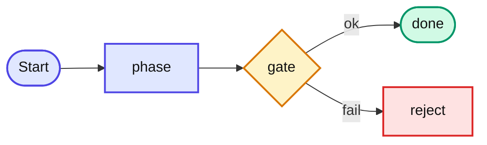

# Guia de estilo da documentação

> Este documento é o **contrato** entre o conteúdo do PDF `agent-spec — Do zero à operação` e as páginas do site. Use-o sempre que adicionar, editar ou migrar conteúdo.

## A arquitetura em duas camadas

A documentação coexiste em duas camadas com URLs estáveis:

📖 Guia (espinha narrativa)

Capítulos do PDF fatiados em páginas (Prefácio, Capítulo 0, Partes I–VIII, Apêndices). Para quem está sendo onboardado ou revisita o porquê.

🔧 Referência técnica

Os 84 arquivos atuais (Skills, Agents, Pipelines, Configuração, etc.). Para quem já sabe e veio consultar campo, flag ou regra.

Cada capítulo do guia termina com **📚 Aprofundamento na Referência** linkando os 1–3 docs técnicos relacionados. Cada doc de Referência pode (idealmente) começar com um link para o capítulo correspondente do guia.

::: danger 🚫 Regra
**Nenhum URL existente da Referência pode quebrar.** Movimentações só com redirect ou link cruzado. O sidebar agrupa visualmente sob "🔧 Referência —" sem mudar slugs.
:::

## Padrão de capítulo do guia

Todo capítulo segue este gabarito:

```markdown
---
title: "Capítulo N — Título com dois-pontos exige aspas"
description: Descrição curta de 1 linha — aparece em previews e SEO.
---

# Capítulo N — Título

> **Pergunta desta parte:** <a pergunta-guia, só no index da Parte>
> **Analogia âncora:** <metáfora memorável>

[Texto narrativo — primeiro o porquê, depois o como]

::: tip 💡 Dica
Recomendação operacional curta.
:::

::: warning ⚠️ Armadilha comum
Erro frequente — venha de caso real sempre que possível.
:::

::: details 🔎 Aprofundamento
Detalhe denso para a segunda leitura. Colapsável.
:::

::: danger 🚫 Regra
Regra inegociável com consequência operacional.
:::

## 📚 Aprofundamento na Referência

- **[Nome do doc (referência)](/url/atual)** — descrição em 1 linha.
- **[Outro doc](/url)** — quando faz sentido.
```

### Frontmatter

::: warning ⚠️ YAML
Títulos com `:` (dois-pontos) **precisam de aspas**. Caso contrário o parser YAML do VitePress quebra:

```yaml
title: "Capítulo 1 — A dor: por que LLMs falham"   ✅
title: Capítulo 1 — A dor: por que LLMs falham    ❌ build error
```

:::

## Callouts oficiais

Use exatamente esses 5 — em qualquer ordem dentro do capítulo:

| Markdown | Renderiza | Quando usar |
| --- | --- | --- |
| `::: info 📝 Nota` | nota verde | Contexto que ajuda, mas não trava o fluxo |
| `::: tip 💡 Dica` | dica azul | Atalho prático ou recomendação operacional |
| `::: warning ⚠️ Armadilha comum` | aviso amarelo | Erro frequente que custa caro |
| `::: details 🔎 Aprofundamento` | colapsável | Detalhe denso para a segunda leitura |
| `::: danger 🚫 Regra` | bloco vermelho | Regra inegociável com consequência operacional |

**Variante oficial restrita**: `::: info 📝 Gabarito` — usada **exclusivamente** nas páginas `exercicios.md` das Partes para apontar o gabarito no Apêndice F. Não use fora desse contexto.

🔎 Aprofundamento — por que os emojis

Os emojis (📝 💡 ⚠️ 🔎 🚫) reforçam o tipo do callout **antes** do leitor processar a cor — útil em leitura rápida e em modo daltônico. São os mesmos do PDF.

## Componentes Vue disponíveis

Registrados em `.vitepress/theme/index.ts`, prontos para uso em qualquer `.md`:

### `<StepCards>` — cartões numerados

Para listas de passos, critérios, convicções, ou qualquer enumeração visual.

```html
<StepCards :steps='[
  { title: "Título do cartão", body: "Texto curto, HTML permitido." },
  { title: "Próximo passo", body: "Outro texto." }
]' />
```

**Props opcionais:**

* `layout="row"` — horizontal com scroll (default: `grid` responsivo).
* `numbered="false"` — esconde a numeração circular.
* Item pode ter `icon: "🔥"` no lugar do número.

### `<CostGradient>` — gradiente de custo

Para mostrar escalada de custo (verde → amarelo → vermelho) como o gradiente da ambiguidade do PDF.

```html
<CostGradient :stages='[
  { label: "Etapa barata",   cost: 1, hint: "1 frase" },
  { label: "Etapa média",    cost: 2, hint: "retrabalho" },
  { label: "Etapa cara",     cost: 3, hint: "incidente" }
]' />
```

`cost` é 1, 2 ou 3. Símbolo default é `💰`; passe `symbol="⏱️"` para outros contextos.

### `<TraceabilityChain>` — cadeia conectada

Para fluxos lineares curtos (4–6 nós) com badge + título + caption.

```html
<TraceabilityChain :chain='[
  { id: "US",   title: "User Story",            caption: "Como X, quero Y" },
  { id: "CA",   title: "Critério de Aceitação", caption: "condição verificável" },
  { id: "CT",   title: "Caso de Teste",         caption: "valida o CA" },
  { id: "Code", title: "Código",                caption: "satisfaz o CT" }
]' />
```

Responsivo: vira vertical em telas pequenas.

### `<Badge>` — badges de framework

Pré-existente. Para marcar tipo de skill/framework:

```html
<Badge type="sdd" />        <!-- SDD -->
<Badge type="minispec" />   <!-- miniSpec -->
<Badge type="taskcard" />   <!-- TaskCard -->
<Badge type="adr" />        <!-- ADR -->
<Badge type="shared" />     <!-- Compartilhada -->
<Badge type="conversa" />   <!-- Conversa -->
```

## Diagramas — quando usar o quê

| Tipo de diagrama | Tecnologia | Exemplo |
| --- | --- | --- |
| Fluxo, decisão, pipeline, lifecycle | **Mermaid** | Anatomia da pipeline, Loop de correção, Lifecycle ADR |
| Lista visual de passos numerados | **`<StepCards>`** | "As 4 peças", "Os 5 critérios" |
| Gradiente de severidade/custo | **`<CostGradient>`** | Ambiguidade na spec → produção |
| Cadeia curta com legendas | **`<TraceabilityChain>`** | US→CA→CT→código |
| Tabela comparativa | Markdown table | Memória lazy vs inline; revalidation vs code-review |

### Mermaid — convenções de cor

Use estas classes em **todo** flowchart do guia para coerência visual:



| Classe | Cor | Semântica |
| --- | --- | --- |
| `phase` | índigo claro | etapa neutra do pipeline |
| `gate` | amarelo claro | gate / decisão |
| `done` | verde claro | sucesso / staged |
| `reject` | vermelho claro | rejeição / loop |
| `debt` | rosa claro | débito anotado |

## Convenções textuais

* **Comandos de skill**: `/nome-da-skill` (ex.: `/agent-spec-sdd-generate-prd`).
* **Paths**: em monospace (`docs/specs/features/...`).
* **Siglas**: defina no primeiro uso de cada capítulo, mesmo que já tenha aparecido antes (`CA = Critério de Aceitação`).
* **Negrito** para conceitos que viram link mais à frente; *itálico* para citação ou ênfase secundária.
* **Não** usar `  
` para quebrar parágrafo — pule linha. `  
` só dentro de tabela ou bloco Mermaid.
* **Português brasileiro com acentos completos**. Nunca substituir por ASCII.

### Jargão técnico em inglês — regra

Quem lê a documentação **não precisa saber inglês**. Para cada termo em inglês:

::: danger 🚫 Regra
**Toda palavra em inglês deve ter equivalente em português no primeiro uso, ou ser explicada entre parênteses.** A documentação é em pt-BR para leitor pt-BR.
:::

Padrão de tradução adotado:

| Termo original | Tratamento |
| --- | --- |
| `mid-development` | **"no meio do desenvolvimento"** (substituir direto) |
| `wall clock` | **"tempo real"** (substituir direto) |
| `rubric` | **"checklist objetiva"** (substituir direto) |
| `drift` | **"divergência"** (substituir direto) |
| `hardcoded` / `hardcode` | **"fixo(s) no código"** (substituir direto) |
| `single source of truth` | **"fonte única de verdade"** (substituir direto) |
| `side-effect` | **"efeito colateral"** (substituir direto) |
| `downstream` | **"em tasks/etapas posteriores"** (substituir direto) |
| `happy path` | **"caminho de sucesso (happy path)"** na 1ª menção, depois "caminho de sucesso" |
| `spike` | **"spike (experimento curto e descartável)"** na 1ª menção, depois manter "spike" |
| `fast-path` | **"fast-path (atalho)"** na 1ª menção, depois "fast-path" (é nome do mecanismo) |
| `wire-up` | **"wire-up (conexão/registro)"** na 1ª menção |
| `fallback` | **"caminho alternativo (fallback)"** ou **"fallback (volta para...)"** |
| `trade-off` | **"trade-off (escolha com prós e contras)"** na 1ª menção |
| `walkthrough` | **"passo a passo"** ou **"demonstração passo a passo"** (substituir direto) |
| `workflow` | **"fluxo de trabalho"** (substituir direto) |
| `placeholder` | **"marcador"** ou **"espaço reservado"** (substituir direto) |
| `subset` | **"subconjunto"** (substituir direto) |
| `snippet` | **"trecho"** (substituir direto) |
| `onboarding` | **"onboarding (capacitação inicial)"** na 1ª menção; depois manter "onboarding" |
| `over-engineering` / `under-engineering` | manter (já estabelecidos no léxico técnico pt-BR) |
| `patch`, `diff`, `stage`, `staged`, `stash` | manter (termos de Git, conhecidos) |
| `snake_case`, `kebab-case`, `camelCase` | manter (convenções de nomenclatura padrão) |
| Identificadores no código (`getUserByEmail`, `flowchart`, etc.) | manter em inglês (são código) |

**Quando criar conteúdo novo:** assuma que o leitor lê português fluentemente e tem nível básico-intermediário de inglês técnico. Se a tradução for forçada ou perder precisão, mantenha o termo original **com explicação entre parênteses na 1ª menção**.

## Inventário de migração — o que falta fatiar

| Parte | Status | Origem (`agent-spec-completo.md`) |
| --- | --- | --- |
| Prefácio | ✅ Migrado (`prefacio.md`) | seção inicial |
| Capítulo 0 | ✅ Migrado (`capitulo-0.md`) | "O framework em 5 minutos" |
| Parte I (caps 1–3) | ✅ Migrado (`partes/parte-1/`) | "Parte I — Fundamentos" |
| Parte II (cap 4) | ✅ Migrado (`partes/parte-2/`) | "Parte II — A Pipeline §4" |
| Parte III (caps 5–9) | ✅ Migrado (`partes/parte-3/`) | "Parte III — Os Frameworks em Profundidade" |
| Parte IV (caps 10–14) | ✅ Migrado (`partes/parte-4/`) | "Parte II — A Pipeline §5–8" |
| Parte V (caps 15–17) | ✅ Migrado (`partes/parte-5/`) | "§7 política débito-controlado" e "§22 /agent-spec-debt-resolution" |
| Parte VI (caps 18–19) | ✅ Migrado (`partes/parte-6/`) | "§16 Testing best-practices" |
| Parte VII (caps 20–22) | ✅ Migrado (`partes/parte-7/`) | "Parte IV — Decisões Arquiteturais (ADRs)" |
| Parte VIII (caps 23–25) | ✅ Migrado (`partes/parte-8/`) | "Parte VI — Observabilidade e Memória" |
| Apêndice A | ✅ Redirect → `/configuration/framework-paths` | "Apêndice A" do consolidado |
| Apêndices B, C | ✅ Migrado (`apendices/B-categorias`, `C-convencoes`) | "Apêndice B, C" do consolidado |
| Apêndice G | ⏳ Pendente (sem fonte no espelho — requer PDF) | — |
| Apêndices D, E, F | ✅ Migrado (versão MVP) | "Apêndice D, E, F" |

::: tip 💡 Para migrar uma Parte
1. Leia a seção correspondente em [`/agent-spec-completo`](../agent-spec-completo.md) e no PDF.
2. Crie o `partes/parte-N/index.md` com pergunta-guia + analogia âncora.
3. Crie um arquivo por capítulo seguindo o gabarito acima.
4. Adicione `partes/parte-N/exercicios.md` (extraia do PDF / gabarito).
5. Atualize `sidebar.ts` substituindo o item "⏳ Em migração" pela lista expandida.
6. Atualize a tabela de inventário acima.
7. Rode `npm run build` antes de commitar.
:::

## Critério de aceitação para um capítulo migrado

Um capítulo está "pronto" quando satisfaz **todos**:

1. **Frontmatter completo** com `title` (aspas se tiver `:`) + `description`.
2. **Pergunta-guia + analogia âncora** no `index.md` da Parte.
3. **Pelo menos um callout** se houver decisão de design ou armadilha.
4. **Pelo menos um diagrama Mermaid ou componente Vue** se houver fluxo, escala ou enumeração.
5. **Seção 📚 Aprofundamento na Referência** linkando 1–3 docs técnicos.
6. **Links internos verificados** com `npm run build` (build falha em link quebrado).
7. **Exercícios da Parte** com gabarito no Apêndice F.

## Fluxo de auditoria contínua

Use a skill `/agent-spec-docs-sync` para detectar divergências entre código (`.claude/skills/`, `.claude/agents/`, `.claude/rules/`) e a documentação atual. Ela reporta:

* Skills/agents/rules **sem doc** correspondente.
* Docs que referenciam **flags/campos inexistentes** no código.
* Capítulos do PDF **ainda não migrados**.
* Links internos **quebrados**.

Rode-a antes de cada release ou após qualquer mudança em `.claude/`.
