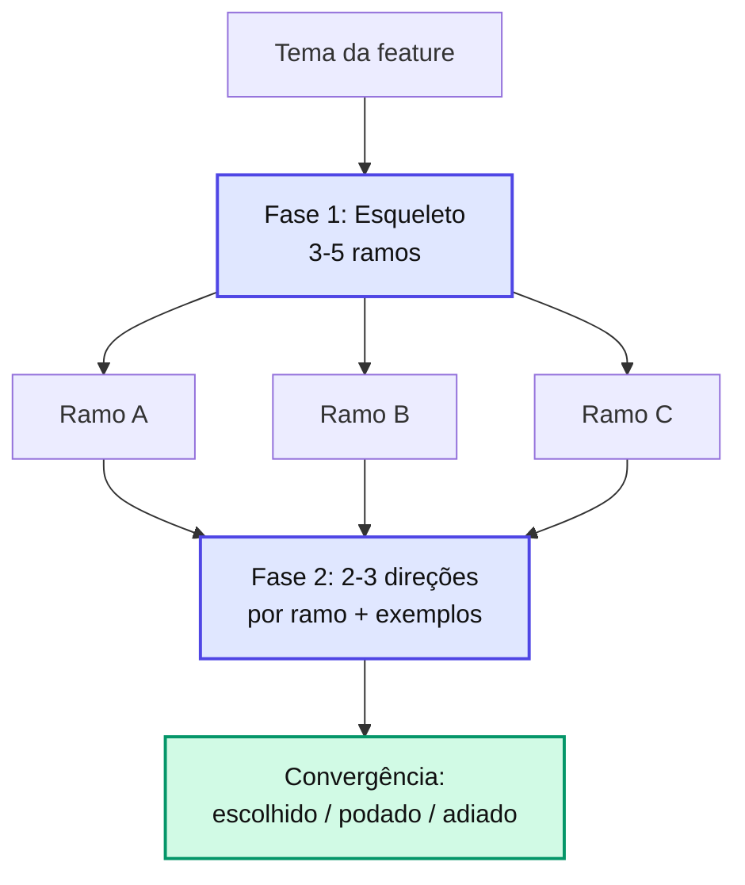

# Brainstorm (Tree of Thought)

> Divergir antes de convergir. O brainstorm **é** o coração do [Pre-Refinement](pre-refinement.md): em vez de coletar requisitos linearmente, explora os rumos que a feature pode tomar via **Tree of Thought (TOT)** e converge com o usuário.

## O que é Tree of Thought aqui

TOT = não fixar na primeira solução mental. Para o tema da feature, **gerar vários ramos, avaliar, podar os fracos e expandir os promissores** — com o usuário no loop nas decisões de poda.



---

## Fase 1 — Esqueleto (os ramos)

A skill gera **3 a 5 bullets concisos** que enquadram os rumos do produto. Cada bullet é um **ramo** (uma dimensão a explorar), não um requisito fechado.

Características de um bom esqueleto:

* **Conciso** — 1 linha por ramo (≤ ~12 palavras).
* **Ortogonal** — ramos cobrem dimensões distintas (público, valor central, integração, monetização…).
* **Ancorado** — nenhum ramo sai do escopo do projeto sem marcação.
* **Divergente** — inclui ≥ 1 ramo que o usuário talvez não tenha pensado.

A skill **apresenta o esqueleto e pausa** (via `AskUserQuestion`): o usuário escolhe quais ramos explorar, adiciona, remove ou repriorize.

---

## Fase 2 — Expansão (direções por ramo)

Para cada ramo aprovado, a skill cresce **2-3 direções candidatas**, no formato:

```markdown
### Ramo A — <título>

- **A1 — <direção>**: <descrição>.
  _Exemplo:_ <exemplo concreto> · _Viabilidade:_ <reusa X / requer Y / [fora do escopo]>
- **A2 — <direção>**: ...
- **A3 — <direção>**: ...

Minha leitura: **A2** parece o melhor custo-benefício porque <razão>. Concorda, prefere outra, ou combinar?
```

Regras:

* **Proponha + pergunte** — sempre dê a leitura recomendada antes de perguntar. Nunca largue só perguntas.
* **Exemplos obrigatórios** — toda direção tem exemplo concreto e nota de viabilidade.
* **≤ 2-3 rodadas** — agrupe ramos relacionados; não itere ad-infinitum.
* **Provocações** quando úteis: "Se tivéssemos 1/10 do tempo, qual seria o MVP?", "Existe alternativa pronta que resolve 80%?".
* **Continua no O QUÊ / POR QUÊ** — nada de arquitetura fina.

---

## Convergência e síntese (seção 14)

Após a expansão, a skill registra o fecho da árvore na **seção 14** do `pre-refinement.md`:

```markdown
## 14. Síntese do Brainstorm
- **Absorvido no escopo inicial (seção 8)**: <direções escolhidas>
- **Descartado com justificativa**: <item — por que não entra>
- **Adiado para v2/v3**: <item>
- **Provocações que mudaram o rumo** (se houve): <...>
```

As direções escolhidas alimentam o **Escopo Inicial** (seção 8); as podadas/adiadas alimentam o **Fora do Escopo** (seção 9). A árvore completa (direções candidatas + escolhida + podadas) fica registrada na **seção 4**.

---

## Princípios

* **Divergir ≠ escopo explodindo** — o brainstorm **levanta opções**, a síntese converge.
* **Alimenta o Strategy Selector** — o número de rumos que sobrevivem é a dimensão **Amplitude** da recomendação de framework.
* **Orçamento de atenção** — máximo 2-3 rodadas. Sem iterações infinitas.
* **Fixes pontuais pulam o TOT cheio** — "validar CPF" vira 1 rodada curta confirmando escopo.

---

## Exemplo real

**Input**: "quero criar um app para controlar minhas etiquetas"

**Fase 1 — Esqueleto** (apresentado e validado):

```
1. Público: colecionador individual (B2C) vs gestão de estoque (B2B)
2. Geração da etiqueta: manual vs scan de QR/barcode
3. Saída: exportar PDF pronto para impressão
4. Monetização: freemium vs pago
→ usuário: explorar 2 e 3; B2C individual cravado; adiar 4
```

**Fase 2 — Ramo 2 (geração)**: 3 direções com exemplo + viabilidade → escolhido **scan de QR/barcode** (reusa câmera do device); manual fica como fallback.

**Síntese**:

* Absorvido: scan de QR/barcode, export PDF.
* Descartado: B2B (fora do foco inicial).
* Adiado para v2: plano premium.

Esse brainstorm convergido chega ao [Strategy Selector](strategy-selector.md) com o escopo já mais completo.

---

## Próximos passos

* [Pre-Refinement](pre-refinement.md) — fluxo onde o brainstorm acontece.
* [Strategy Selector](strategy-selector.md) — recomendação por complexidade (consome a Amplitude).
* [Frameworks — Overview](../frameworks/overview.md) — escolha de caminho.
