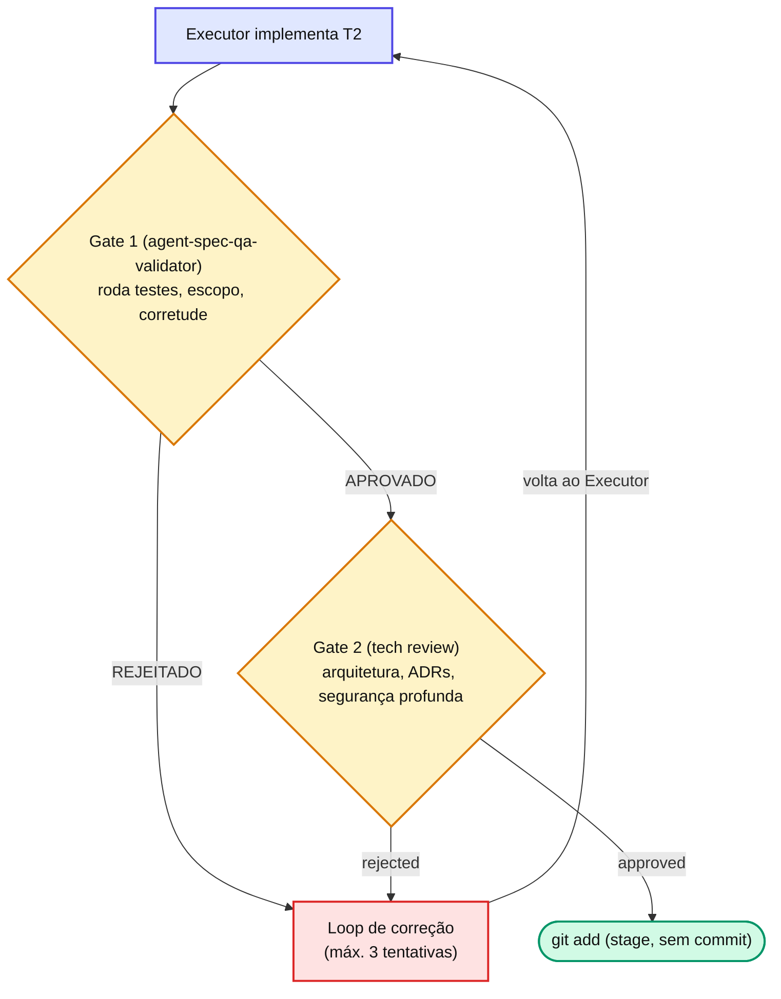
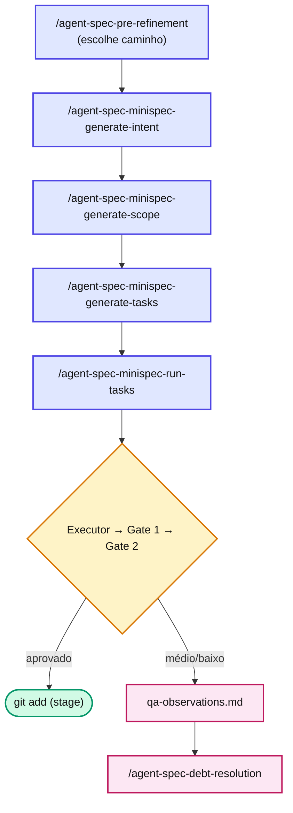

# Capítulo 4 — Demonstração passo a passo: uma feature pequena de ponta a ponta

Nossa feature de exemplo: **"exportar a lista de usuários em CSV"**. Pequena, isolada, mas com lógica suficiente para passar por todas as fases. Acompanhe os cinco passos.

## Passo 1 — Descoberta e escolha do caminho (`/agent-spec-pre-refinement`)

Você começa conversando com o framework sobre o que quer. A skill `/agent-spec-pre-refinement` aplica um **Strategy Selector** — uma checklist objetiva de sinais que dissecamos na [seção "Os quatro caminhos"](../../agent-spec-completo.md#_3-os-quatro-caminhos) — e recomenda o caminho:

```text
/agent-spec-pre-refinement "exportar lista de usuários em CSV"

→ Strategy Selector analisa: escopo pequeno, 1 user story,
  sem decisão arquitetural nova, baixo risco.
→ Recomendação: miniSpec (poderia ser TaskCard se fosse 1 arquivo só).
```

Como há um endpoint, um serializador e testes — mais de um arquivo, mas ainda simples — seguimos com **miniSpec**.

::: warning ⚠️ Armadilha comum
Começar como TaskCard "porque parece simples" e descobrir 4 tasks depois que era miniSpec. O custo de **promover** (refazer como miniSpec) é alto; o de **degradar** (rodar miniSpec numa coisa trivial) é só um pouco de overhead. **Na dúvida, suba uma estrada.**
:::

## Passo 2 — Gerar a especificação

Para o caminho miniSpec, geramos `intent.md` (o quê + por quê) e `scope.md` (componentes, paths, padrões):

```text
/agent-spec-minispec-generate-intent
→ docs/specs/features/exportar-usuarios-csv/v1/intent.md

/agent-spec-minispec-generate-scope
→ docs/specs/features/exportar-usuarios-csv/v1/scope.md
   (pergunta a variante: web / mobile / backend → backend)
```

Depois, decompomos em tasks executáveis. Esta skill também aciona o `agent-spec-qa-test-generator`, que já escreve os casos de teste (CTs) de cada task:

```text
/agent-spec-minispec-generate-tasks
→ tasks/T1.md (endpoint GET /users/export)
→ tasks/T2.md (serializador CSV)
→ cada task já vem com seus CTs
```

::: info 📝 Nota
Repare que **ainda não escrevemos código**. Toda a ambiguidade — formato do CSV, colunas, tratamento de lista vazia — foi resolvida no `scope.md` e nos CTs. A LLM vai implementar com buracos mínimos para preencher.
:::

## Passo 3 — Executar a pipeline (`/agent-spec-minispec-run-tasks`)

Agora o orquestrador entra em cena. Ele monta o grafo de dependências, descobre que **T2 (serializador) precisa existir antes de T1 (endpoint que o usa)**, e executa em ordem:

```bash
/agent-spec-minispec-run-tasks docs/specs/features/exportar-usuarios-csv/v1/task_plan.md backend-developer
```

Para cada task, um executor (agente da stack) implementa e devolve um sumário curto: arquivos criados/modificados, testes N/M, pendências.

## Passo 4 — Os dois gates revisam

É aqui que o framework protege o resultado. Cada task passa por:



Digamos que no T2 o Gate 1 detecte que o serializador não trata lista vazia (um CA violado). Veredito: **REJEITADO**. O orquestrador monta um prompt de correção listando exatamente o problema e devolve ao executor. Segunda tentativa: o executor adiciona o tratamento, os testes passam, **Gate 1 APROVADO**, **Gate 2 approved**.

## Passo 5 — Stage e dívida

Com os dois gates aprovados, o orquestrador faz `git add` (stage, **sem commit** — o commit é seu). Se algum gate tivesse encontrado um problema **médio/baixo** (digamos, um nome de variável subótimo), a task ainda seria aprovada com observações, e a dívida iria para `qa-observations.md` — para ser limpa depois com `/agent-spec-debt-resolution`.

## O fluxo inteiro, de uma vez



::: tip 💡 Dica
**Guarde este capítulo.** Quando uma parte mais adiante mergulhar nos detalhes de, digamos, a Camada 0 do Gate 1, volte aqui para lembrar onde aquela peça se encaixa no fluxo.
:::

## 📚 Aprofundamento na Referência

* **[`/agent-spec-pre-refinement` (skill)](../../skills/shared/pre-refinement.md)** — como o Strategy Selector recomenda o caminho.
* **[Pipeline — visão geral (referência)](../../pipeline/overview.md)** — anatomia detalhada da execução.
* **[`agent-spec-qa-validator` (agente)](../../agents/qa-validator.md)** — o Gate 1 em profundidade.
* **[`agent-spec-staff-architecture-review` (agente)](../../agents/staff-architecture-review-agent.md)** — o Gate 2 em profundidade.
