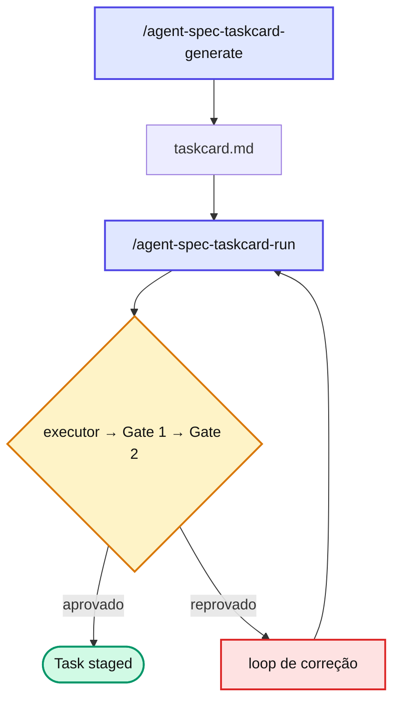

# Capítulo 6 — TaskCard: quando 1 task basta

**Quando usar**: mudança pontual e isolada, sem decomposição — bug fix, ajuste de UI, refactor de 1 arquivo, atualização de config.

**Quando NÃO usar**: qualquer coisa que envolva ≥ 2 user stories (US) ou ≥ 2 tasks. Promova para miniSpec.

## Anatomia

Um único arquivo `taskcard.md` em `docs/specs/features/{feature}/{version}/`. Ele carrega **todo o contexto necessário**: ID, objetivo, arquivos impactados, critérios de aceitação (CAs) e testes. Sem PRD, sem tech_spec — a economia é justamente não produzir artefatos que uma mudança de um arquivo não paga.

## Pipeline

O TaskCard usa **o mesmo motor** de execução do miniSpec e do SDD (executor → gates → stage, detalhado na Parte IV). A única diferença é o gerador: um cartão único em vez de PRD + tech_spec ou intent + scope.

## Fast-path opcional

::: tip 💡 Dica
TaskCards que seguem um padrão já existente (ex.: CRUD trivial) podem declarar `gates: [qa]` no frontmatter para **pular o Tech Review** (Gate 2). É o reconhecimento de que mudança previsível não paga uma segunda revisão profunda. Detalhe em [Fast-path Gates](../../advanced/fast-path-gates.md).
:::

## 📚 Aprofundamento na Referência

* **[TaskCard (framework)](../../frameworks/taskcard.md)** — anatomia completa e frontmatter da task.
* **[`/agent-spec-taskcard-generate`](../../skills/taskcard/taskcard-generate.md)** e **[`/agent-spec-taskcard-run`](../../skills/taskcard/taskcard-run.md)** — gerador e executor.
* **[Fast-path Gates](../../advanced/fast-path-gates.md)** — quando pular o Gate 2 é seguro.
