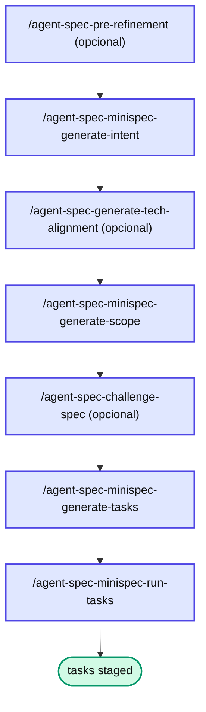

# Capítulo 7 — miniSpec: quando são 1-3 user stories

**Quando usar**: feature pequena a média — 1 a 3 user stories (US), complexidade técnica moderada, sem decisões arquiteturais novas relevantes.

**Quando NÃO usar**:

* **Promova para SDD** se: ≥ 4 US, decisões que merecem ADR, refactor cross-módulo.
* **Degrade para TaskCard** se: 1 US trivial, sem dependência interna.

## Anatomia

```text
docs/specs/features/<feature>/<version>/
├── pre-refinement.md     (opcional, recomendado)
├── intent.md             (O QUE + POR QUÊ)
├── tech-alignment.md     (opcional)
├── scope.md              (componentes, paths, padrões)
├── task_plan.md          (decomposição + ordem + paralelismo)
├── tasks/T1.md … Tn.md
├── qa-observations.md    (gerado na execução)
└── minispec_state.yaml   (rastreabilidade)
```

## Pipeline



## Variantes: web, mobile, backend

Cada variante muda **template e checklist** do `scope.md` e dos templates de task — **não** o path (o arquivo continua `scope.md`, sem sufixo). A variante é gravada em `minispec_state.yaml` (`variant: web | mobile | backend`) e na §1 do `scope.md`.

::: warning ⚠️ Armadilha comum
A `FASE 0.0` da skill `agent-spec-minispec-generate-scope` **sempre** confirma a variante via `AskUserQuestion`, mesmo quando há `tech-alignment.md` presente. O alignment **pré-sugere**, não substitui a confirmação — assumir a plataforma errada propaga template e checklist incorretos até a hora de escrever os testes.
:::

## 📚 Aprofundamento na Referência

* **[miniSpec (framework)](../../frameworks/minispec.md)** — anatomia, variantes e estado.
* **[`/agent-spec-minispec-generate-intent`](../../skills/minispec/minispec-generate-intent.md)** · **[`-generate-scope`](../../skills/minispec/minispec-generate-scope.md)** · **[`-generate-tasks`](../../skills/minispec/minispec-generate-tasks.md)** — a cadeia geradora.
* **[`/agent-spec-minispec-run-tasks`](../../skills/minispec/minispec-run-tasks.md)** — o orquestrador de execução.
