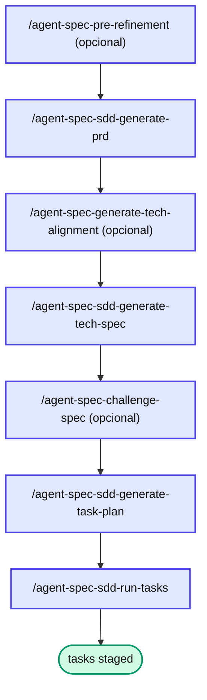

# Capítulo 8 — SDD: quando a feature é complexa

SDD (Spec-Driven Development) é o caminho mais pesado — e o que mais paga quando a feature é grande.

**Quando usar**: ≥ 4 user stories (US), decisões arquiteturais relevantes (candidatas a ADR), refactor cross-módulo, alto custo de retrabalho.

**Quando NÃO usar**: features menores. O SDD custa ~1.5M tokens em discovery + geração. Para 1-3 US, o miniSpec entrega o mesmo valor por ~500-800k.

## Anatomia

```text
docs/specs/features/<feature>/<version>/
├── prd.md            (US + CAs + personas + KPIs)
├── tech_spec.md      (arquitetura + ADRs + Estratégia de Testes)
├── task_plan.md      (decomposição + fases + paralelismo)
├── tasks/T1.md …     (§4 Aceite Técnico, §5 Arquivos Impactados)
├── .qa_context.md    (resumo denso para os gates)
├── qa-observations.md
└── sdd_state.yaml
```

## Pipeline



## O `.qa_context.md` — resumo denso

::: info 📝 Nota
Os gates rodam **uma vez por task**. Sem o `.qa_context.md`, cada invocação releria o `tech_spec.md` inteiro. O resumo denso — convenções, decisões arquiteturais, padrões obrigatórios, paths críticos — faz o gate consumir ~5-10x menos tokens em discovery, mantendo a fonte canônica disponível para detalhe sob demanda (lazy). É o princípio do **contexto mínimo** aplicado aos gates.
:::

## 📚 Aprofundamento na Referência

* **[SDD (framework)](../../frameworks/sdd.md)** — anatomia completa e estado.
* **[`/agent-spec-sdd-generate-prd`](../../skills/sdd/sdd-generate-prd.md)** · **[`-generate-tech-spec`](../../skills/sdd/sdd-generate-tech-spec.md)** · **[`-generate-task-plan`](../../skills/sdd/sdd-generate-task-plan.md)** — a cadeia geradora.
* **[qa_context pré-extraído](../../advanced/qa-context.md)** — a otimização de contexto dos gates.
