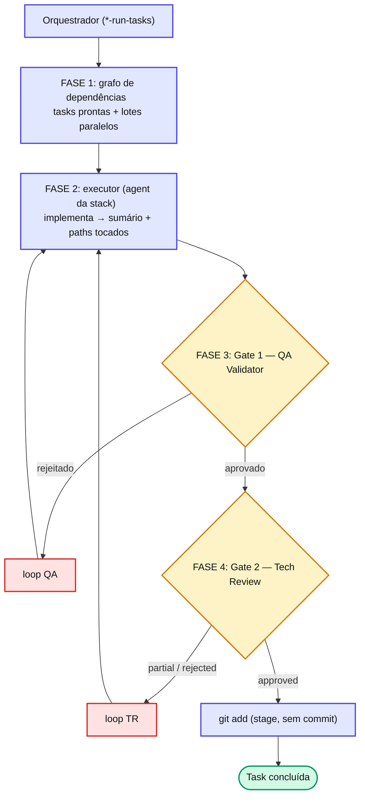

# Capítulo 10 — Anatomia da pipeline de execução

Todo orquestrador `*-run-tasks` — seja SDD, miniSpec ou TaskCard — segue **a mesma anatomia**. Muda o gerador da spec; o motor de execução é idêntico.

## As quatro fases

## Quatro invariantes

1. **Contador de tentativas compartilhado** entre Gate 1 e Gate 2 (máximo 3, **não reseta** entre gates).
2. **Gate 1 é o único que executa testes.** Gate 2 só re-executa em três casos: QA não executou; QA rodou parcial em área crítica; ou Tech Review detectou violação `critical` em arquitetura/segurança.
3. **Gate 2 não recebe o JSON completo do QA** — apenas ~7 campos do sumário (veredito, security_flags, executou_testes, escopo_testes, tocou_area_critica, escopo_declarado…). Economia de ~5k tokens por task — o princípio do **contexto mínimo** em ação.
4. **`git add` sem commit** — o orquestrador apenas faz stage. O commit fica com o humano (ou com `/agent-spec-semantic-commit`).

::: tip 💡 Dica
Tasks na mesma fase do `task_plan.md`, marcadas como paralelizáveis e com **paths disjuntos**, rodam concorrentemente (limite `MAX_PARALLEL = 4`). Qualquer guard que falhe → fallback automático para execução sequencial, com o motivo logado em `qa-observations.md`.
:::

## 📚 Aprofundamento na Referência

* **[Pipeline — visão geral](../../pipeline/overview.md)** — anatomia operacional detalhada.
* **[Contexto mínimo (referência)](../../concepts/minimum-context.md)** — por que o Gate 2 recebe só o sumário.
* **[Gates e Loops](../../concepts/gates-loops.md)** — o fluxo completo de validação.
