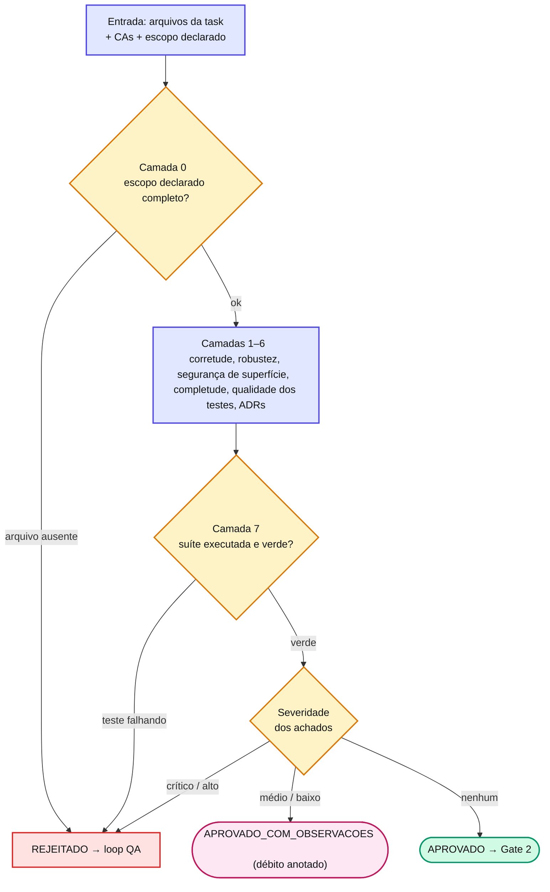

# Capítulo 11 — Gate 1: o QA Validator

O Gate 1 (`agent-spec-qa-validator`) é o **olho funcional** da pipeline. Ele responde a uma pergunta: *o código faz o que a task pediu, com robustez e testes que pegam bugs reais?* São **oito camadas**, todas obrigatórias.

## As oito camadas

| # | Camada | Pergunta central |
| --- | --- | --- |
| **0** | Completude de escopo declarado | Todos os arquivos declarados na task existem mesmo? (bloqueante, **primeira**) |
| **1** | Corretude | Cada critério de aceitação (CA) passou? (`PARCIAL` conta como falha) |
| **2** | Robustez | Trata null/vazio/erro? Estados de UI? Race de UI? |
| **3** | Segurança de superfície | Injeção, XSS óbvio, segredos hardcoded |
| **4** | Completude | Cenários, validações e mensagens faltando? |
| **5** | Qualidade dos testes | Antipadrões de teste (5 famílias) via `agent-spec-testing-best-practices` |
| **6** | ADR Compliance Light | Sweep grep-detectável de ADRs ativas |
| **7** | Testes automatizados | Existência + **execução da suíte** (bloqueante) |

::: info 📝 Nota
A **Camada 0** foi adicionada depois que descobrimos que **CAs frouxos mascaravam entregas parciais** — a task declarava 3 endpoints + 1 migration, o executor entregava 2, e CAs genéricos passavam. Ela cruza a lista declarada (`§5.1/§5.2` no SDD, `§3.1/§3.2` no miniSpec) contra o working tree: arquivo declarado e ausente → CRÍTICO. CAs validam **comportamento**; a Camada 0 valida **presença estrutural** — duas coisas diferentes.
:::

Em fluxo, o Gate 1 funciona assim:

## O único gate que roda testes

A Camada 7 é o que torna o Gate 1 especial: ele **executa a suíte**.

* **Suíte completa** quando a task toca shared/core/utils/auth/DI/rotas/schemas globais ou altera contrato consumido por outras features.
* **Parcial** (feature + dependentes diretos + smoke) quando a task é isolada.
* Qualquer teste falhando — inclusive regressão em outra área — → `REJEITADO`.

O campo `testes_executados.tocou_area_critica` é o sinal que orienta o **Gate 2** a re-executar ou não a suíte.

::: warning ⚠️ Armadilha comum
A política de veredito é **débito-controlado**: só `crítico`/`alto` reprovam; `médio`/`baixo` viram débito anotado (`APROVADO_COM_OBSERVACOES`). Não confunda "aprovado com observações" com "ignorar" — cada observação fica em `problemas.*` com correção sugerida, recolhida depois por `/agent-spec-debt-resolution`. O detalhe da política está na Parte V.
:::

## 📚 Aprofundamento na Referência

* **[agent-spec-qa-validator (Gate 1)](../../agents/qa-validator.md)** — o agente completo, camada a camada.
* **[Testing Best Practices](../../concepts/testing-best-practices.md)** — os antipadrões da Camada 5.
* **[Gates e Loops](../../concepts/gates-loops.md)** — a política débito-controlado em contexto.
