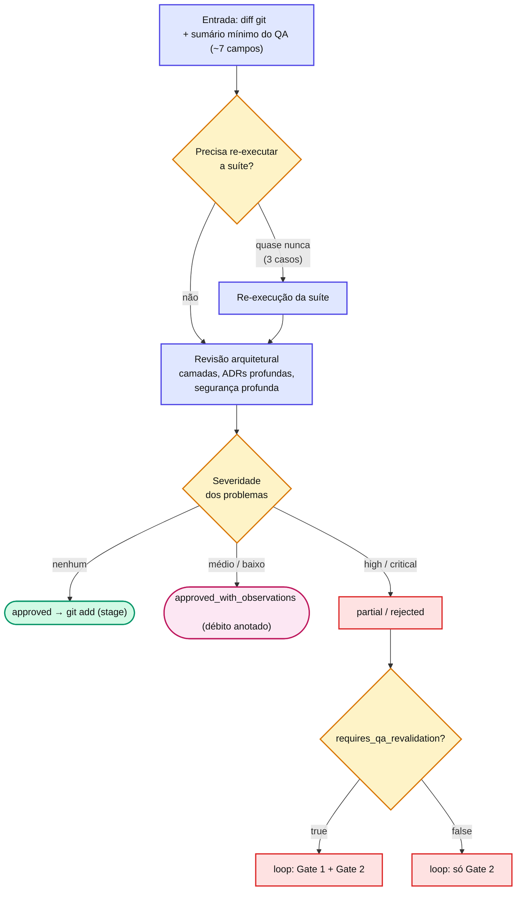

# Capítulo 12 — Gate 2: o Tech Review

O Gate 2 (`agent-spec-staff-architecture-review`) é o **olho arquitetural**. Sua invocação pressupõe que o Gate 1 já aprovou funcionalmente — por isso ele trabalha sobre o **diff git** + um sumário mínimo do QA, não o JSON inteiro.

## O que valida — e o que não

| Valida (Gate 2) | Não valida (já é Gate 1) |
| --- | --- |
| Arquitetura: camadas, dependências, Repository/Service | Corretude funcional contra CAs |
| Boas práticas: acoplamento, coesão, DRY, complexidade | Robustez funcional óbvia |
| Conformidade **profunda** com ADRs | Segurança **de superfície** (XSS óbvio, input validation) |
| Segurança profunda: IDOR, escalação, fluxos de token, CSP | — |

::: info 📝 Nota
O Gate 2 **confia no JSON do QA** para corretude funcional — não re-valida CA por CA. Essa divisão de trabalho é o que mantém o custo baixo: cada gate olha só a sua dimensão, sem sobreposição.
:::

## Re-execução de testes — quase nunca

O Gate 2 **não roda a suíte** por padrão. Só re-executa quando:

* o QA reportou `executou_testes: false` ou `escopo_testes: "NAO_EXECUTADO"`;
* o QA rodou `PARCIAL` **e** `tocou_area_critica: true`;
* ele mesmo detecta violação `critical` em arquitetura/segurança com risco de regressão sistêmica.

## Status (débito-controlado)

| Condição | Status |
| --- | --- |
| `problems: []` | `approved` |
| Só `medium`/`low` (sem `critical` nem `high`) | `approved_with_observations` |
| Há `high` (sem `critical`) | `partial` |
| Há `critical` | `rejected` |
| QA retornou `REJEITADO` | `skipped_qa_rejected` |

`partial` e `rejected` disparam loop; `approved_with_observations` vira débito anotado, igual ao Gate 1.

O fluxo completo, do diff ao veredito:

A bifurcação final — corrigir e voltar pelos **dois** gates ou só pelo Gate 2 — é a classificação `requires_qa_revalidation`, detalhada no [Capítulo 13](capitulo-13.md).

## 📚 Aprofundamento na Referência

* **[agent-spec-staff-architecture-review (Gate 2)](../../agents/staff-architecture-review-agent.md)** — o agente completo.
* **[Gates e Loops](../../concepts/gates-loops.md)** — como o status alimenta o loop.
* **[Auto-escalação](../../advanced/auto-escalation.md)** — quando o Gate 2 sobe para Opus.
