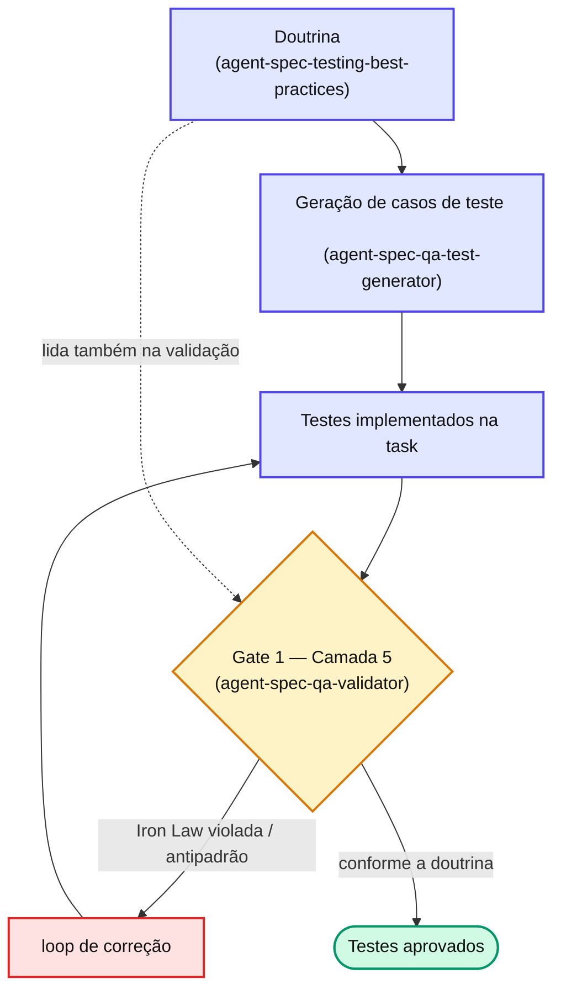

# Capítulo 18 — Iron Laws e antipadrões

A skill `agent-spec-testing-best-practices` é a **doutrina de testes agnóstica de stack** (backend, frontend, mobile). Ela é lida obrigatoriamente pelo Gate 1 (Camada 5) e pelo gerador de casos de teste. Começa por cinco regras que não se negociam.

## As Iron Laws (regras invioláveis)

1. **Determinismo** — o teste roda igual 100x. Sem `Date.now()`, `Math.random()` ou locale sem injeção.
2. **Independência** — a ordem de execução não importa. `.only` ou ordem alternada não muda o resultado.
3. **Foco** — 1 teste valida 1 comportamento, não "o módulo inteiro".
4. **Asserção significativa** — `expect(true).toBe(true)`, `.toBeTruthy()`, `.toBeDefined()` sem valor específico são proibidos.
5. **Mock budget** — se um teste mocka todos os colaboradores, **deve ter** companheiro de integração. Mockar tudo sozinho é teste sobre o mock, não sobre o sistema.

## As cinco famílias de antipadrões

| Família | O que captura | Exemplos |
| --- | --- | --- |
| **Brittleness** | Testes que quebram à toa | seletor frágil, asserção de mera existência, snapshot-as-test, testar estrutura interna |
| **Flakiness** | Testes intermitentes | sleep fixo, dependência de ordem, input não-determinístico, retry-as-fix |
| **Mock misuse** | Mocks que mentem | mock-driven confidence, over-mock, mock incompleto, mock no nível errado |
| **Process** | Padrões organizacionais ruins | só happy path, cobertura como vaidade, quarentena-cemitério, magic strings, enfraquecer teste para passar |
| **AI-specific** | Padrões introduzidos por IA | zero edge cases, teste semanticamente duplicado, fail-fast intestável |

::: warning ⚠️ Armadilha comum
Os antipadrões **AI-specific** são os mais traiçoeiros: uma IA gera 6 asserções positivas e zero negativa, ou dois testes que validam o mesmo cenário com nomes diferentes. Tudo verde, tudo inútil. É por isso que a doutrina é lida tanto na **geração** quanto na **validação** dos testes.
:::
> A lista canônica completa (com cada antipadrão nomeado em snake_case e severidade pré-mapeada) vive na Referência — esta tabela é um mapa das famílias, não o catálogo exaustivo.

## 📚 Aprofundamento na Referência

* **[Testing Best Practices](../../concepts/testing-best-practices.md)** — a doutrina completa, com o catálogo de antipadrões.
* **[agent-spec-qa-validator (Gate 1)](../../agents/qa-validator.md)** — quem aplica a Camada 5.
* **[agent-spec-testing-stack-bootstrap](../../skills/shared/testing-stack-bootstrap.md)** — descobre a stack de teste do projeto.
