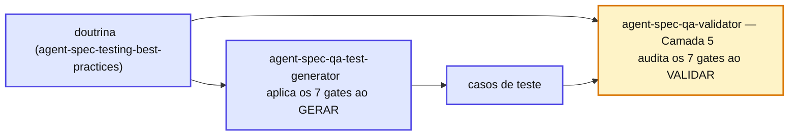

# Capítulo 19 — Os 7 gates que cada teste atravessa

As Iron Laws dizem o que **não** fazer. Os **7 gates** são a checklist operacional: cada teste novo passa por sete checagens antes de ser aceito.

## As sete checagens

1. **Determinismo confirmado** — roda 5x local sem mudança.
2. **Failure mode entendido** — sei exatamente que mudança no código quebra este teste.
3. **Asserção específica** — valor exato, não `.toBeDefined()`.
4. **Mock budget respeitado** — não mocka tudo em isolamento.
5. **Cenário negativo presente** — todo caminho de sucesso (happy path) tem teste companheiro de erro.
6. **Sem duplicata semântica** — não existe outro teste com a mesma combinação `(alvo, input, esperado)`.
7. **Edge cases** — null, vazio, limites.

## Geração e validação usam a mesma régua

O gerador é **treinado** nesses 7 gates; o validador os usa como **checklist de auditoria**. A mesma doutrina nos dois lados garante que o teste nasce e é cobrado pelo mesmo padrão.

::: tip 💡 Dica
O gate mais esquecido pela IA é o **#5 (cenário negativo)**: é fácil gerar o caminho feliz e parar. Por isso o `negative_companion` é campo **obrigatório** em cada caso de teste que o gerador produz — sem par negativo, o caso não passa.
:::

## 📚 Aprofundamento na Referência

* **[agent-spec-qa-test-generator](../../agents/qa-test-generator.md)** — o gerador que aplica os 7 gates.
* **[agent-spec-qa-validator (Gate 1)](../../agents/qa-validator.md)** — o validador que os audita.
* **[Testing Best Practices](../../concepts/testing-best-practices.md)** — a doutrina completa.
