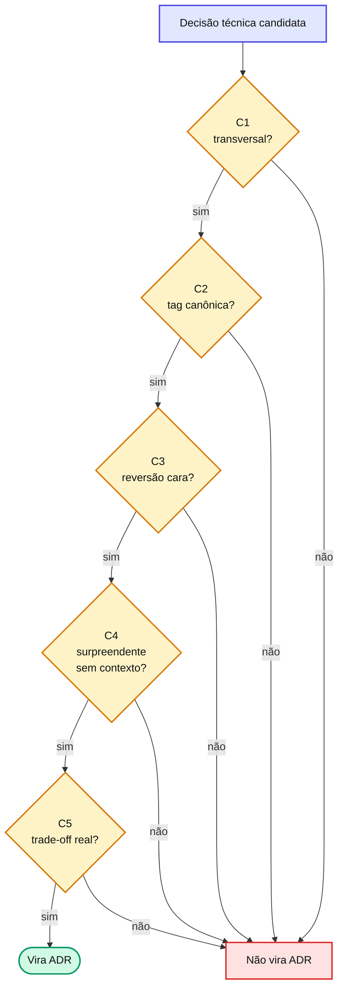

# Capítulo 20 — O que vira ADR

ADR (Architecture Decision Record) é registro **do projeto**, não da feature. Nem toda escolha técnica merece uma — registrar demais é tão ruim quanto registrar de menos. Para virar ADR, **TODOS os 5 critérios precisam ser verdadeiros** (`require_all`).

## Os 5 critérios

| # | Critério | Pergunta diagnóstica |
| --- | --- | --- |
| C1 | `transversal` | A decisão se aplica a outras features ou ao projeto inteiro (não é feature-específica)? |
| C2 | `tag_alvo` | A decisão cai em uma das 14 tags canônicas? |
| C3 | `custo_reversao_alto` | Reverter implica refactor significativo (≥ médio) em múltiplos lugares? |
| C4 | `surpreendente_sem_contexto` | Um leitor futuro vai se perguntar "por que fizeram assim?" sem este registro? |
| C5 | `trade_off_real` | Havia ao menos UMA alternativa genuinamente considerada e rejeitada por razão específica? |

Cada critério tem um propósito: C1 evita poluir com decisões locais; C2 garante busca/filtro; C3 evita registrar o que é fácil mudar; C4 garante valor de leitura futura; C5 força explicitar o trade-off — **ADR sem alternativa rejeitada é documentação, não decisão.**

::: warning ⚠️ Armadilha comum
O `require_all` é estrito de propósito. Uma decisão "importante" mas **reversível barata** (falha C3), ou "interessante" mas **óbvia** (falha C4), não vira ADR. Registrar tudo transforma o `docs/adr/` num cemitério de ruído que ninguém lê — e aí até as ADRs que importam perdem credibilidade.
:::

## As 14 tags canônicas e quem detecta

A tag (C2) deve ser uma de: `architecture`, `auth`, `security`, `data`, `http`, `validation`, `testing`, `build`, `observability`, `performance`, `ui`, `error-handling`, `cross-cutting`, `state-management`. Tags fora da lista são rejeitadas por `/agent-spec-adr-create` — a restrição força consistência cross-projeto.

Candidatas são detectadas por: as skills de geração de spec (`sdd-generate-tech-spec`, `minispec-generate-scope`), pelo stress-test `/agent-spec-challenge-spec`, ou manualmente via `/agent-spec-adr-create`.

## 📚 Aprofundamento na Referência

* **[ADRs — visão geral](../../adr/overview.md)** — os 5 critérios e o papel das ADRs.
* **[/agent-spec-adr-create (skill)](../../skills/adr/adr-create.md)** — o gerador que valida critérios e tags.
* **[/agent-spec-challenge-spec (skill)](../../skills/shared/challenge-spec.md)** — descobre decisões implícitas que merecem ADR.
