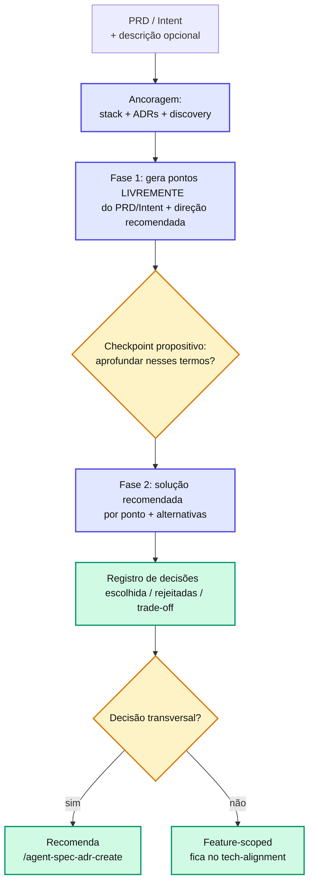

# agent-spec-generate-tech-alignment

`Shared` `Discovery`
> **Resumo**: **Arquiteto de soluções**. A partir de um PRD (SDD) ou Intent (miniSpec), **propõe soluções técnicas** para a feature. Em uma Fase 1, **gera livremente** — a partir do PRD/Intent + ancoragem no stack/ADRs — os pontos onde há solução técnica a propor (sem template, sem cota). Em uma Fase 2, lidera com a **solução recomendada** por ponto + alternativas viáveis com trade-offs, e **registra as decisões** (escolhida + rejeitadas + justificativa + trade-off) em um `tech-alignment.md` **livre**. **Trava dupla**: não reabre negócio/produto (o QUE/PORQUÊ vêm do PRD/Intent) **nem** desce a detalhe de implementação (endpoints/schemas/tabelas — isso é do TECH_SPEC/SCOPE). Compartilhado entre SDD e miniSpec via `tech_alignment.path`.

---

## Quando usar

* Após `prd.md` (SDD) ou `intent.md` (miniSpec) aprovado, para **decidir a arquitetura** antes do TECH_SPEC/SCOPE.
* Quando há ≥ 1 decisão técnica não trivial a tomar (persistência, sincronismo, auth, contrato de integração, consistência).
* Mesmo sem uma solução em mente — a skill **propõe os caminhos**, não exige que você traga a resposta pronta. Se a feature não forçar nenhuma decisão arquitetural aberta, a skill diz isso e registra os padrões herdados (não inventa pontos).

## Quando NÃO usar

* Para decidir **regra de negócio/produto** (o QUE, o porquê, percentuais, elegibilidade) → isso é do [agent-spec-pre-refinement](pre-refinement.md) / PRD / Intent. A skill **não reabre** essas decisões.
* Para especificar o COMO completo (endpoints, schemas, arquivos) → isso é do [agent-spec-sdd-generate-tech-spec](../sdd/sdd-generate-tech-spec.md) / [agent-spec-minispec-generate-scope](../minispec/minispec-generate-scope.md).

---

## Inputs

| Input | Origem | Obrigatório? |
| --- | --- | --- |
| Caminho do `prd.md` (SDD) ou `intent.md` (miniSpec) | Usuário (arg 1) | **Sim** |
| Descrição técnica em texto livre do que você já imagina | Usuário (arg 2) | **Não** — se vier, entra como **uma das alternativas**; se não, a skill propõe do zero |
| PRD/Intent + discovery (`pre-refinement.md`, `pre-alignment.md`, `*handoff*.md`) | Varredura | Sim |
| `CLAUDE.md` + `.claude/rules/*` + **ADRs ativas** (`docs/adr/INDEX.md`) | Ancoragem | Sim |

> A skill **detecta o framework** pelo nome do arquivo (`prd.md` → SDD; `intent.md` → miniSpec). Se não conseguir, pergunta.

## Outputs

| Artefato | Path resolvido | Consumido por |
| --- | --- | --- |
| `tech-alignment.md` | `tech_alignment.path` → `/docs/specs/features/{feature}/{version}/tech-alignment.md` | [agent-spec-sdd-generate-tech-spec](../sdd/sdd-generate-tech-spec.md) (SDD), [agent-spec-minispec-generate-scope](../minispec/minispec-generate-scope.md) (miniSpec) |

> Path **único e compartilhado** entre os dois frameworks. Os consumidores tratam as decisões registradas como **prioridade** sobre suas próprias propostas e pré-leem o campo **Variante** como sugestão de default.

---

## A trava dupla (o território da skill)

::: warning ⚠️ Armadilha comum
A skill vive **no meio** de dois limites. Antes de levantar qualquer ponto, faça a pergunta de calibragem: **"isso é uma escolha técnica de arquitetura?"**
* **Limite superior — negócio/produto não entra.** O **QUE** a feature faz e o **POR QUÊ** já foram decididos no PRD/Intent/pre-refinement. A skill **não** pergunta nem decide regra de negócio, escopo, prioridade ou política comercial. Forçar pontos para preencher cota leva direto a **perguntas de negócio disfarçadas** — o sintoma clássico de drift. Dependência de produto não resolvida → "Pontos em aberto", nunca decisão da skill.
* **Limite inferior — implementação não entra.** Endpoints, schemas, tabelas, campos, arquivos, middlewares são do TECH_SPEC/SCOPE.
E a diferença entre **propor** e **inventar** é o **ancoramento**:
* ✅ **Propor (ancorado)**: "Para o cache local, vejo 3 caminhos dado o stack: (A) SQLite — o projeto já usa em X; (B) in-memory com TTL; (C) reusar o Redis do módulo Y. Recomendo C porque já está provisionado."
* ❌ **Inventar (sem âncora)**: cravar uma tecnologia que o projeto não tem, sem justificativa e sem marcar como hipótese.
:::

---

## Propor soluções — o método

A skill **propõe**: para cada ponto onde a feature força uma escolha de arquitetura, lidera com a **solução recomendada** e — quando há mais de um caminho viável — mostra 2-3 alternativas com exemplo, trade-off e viabilidade contra o projeto. Pergunta é **exceção** (dúvida técnica sobre o que existe ou confirmação), não default.

Um ponto **só qualifica** quando há **≥ 2 abordagens viáveis** *e* o stack/ADRs/padrões **não determinam** já a resposta. Se já determinam → é restrição herdada. Se a feature não força nenhuma escolha → **zero pontos é resposta válida**.

::: tip 💡 Dica
**Simplicidade e escopo são princípio-guia.** A recomendação default é sempre a **mais simples que resolve** o que a feature pede (KISS/YAGNI). A ancoragem no codebase serve a isso: **reuso do que já existe** (módulos, libs, infra provisionada) vence tecnologia/abstração nova — que só entra quando o existente comprovadamente não atende, marcada como hipótese. Nada mirabolante e nada de refactor/troca de stack fora do escopo: débito que a skill notar fora do escopo vai para **"Pontos em aberto"** como observação, nunca como proposta. Espelha a doutrina de [executor-discipline](../../configuration/executor-discipline.md) (Simplicidade Primeiro / Mudanças Cirúrgicas) — a decisão tomada aqui é o que o executor vai implementar.
:::



---

## As 2 fases

### Fase 1 — Gera os pontos livremente + direção recomendada

A skill lê o PRD/Intent + a ancoragem e **gera livremente** os pontos onde a feature força uma escolha de arquitetura — **sem template e sem cota fixa**. Cada ponto vem acompanhado da **direção que a skill recomenda**. Há **um único checkpoint propositivo** (não um questionário): "posso aprofundar nesses termos? faltou algum ponto técnico, ou há dúvida sobre o que já existe?". Se não houver ponto aberto, a skill diz isso e segue.

### Fase 2 — Solução recomendada por ponto + alternativas

Para cada ponto, a skill **lidera com a solução recomendada** e — quando existe mais de um caminho viável — mostra **2-3 alternativas**, cada uma com **exemplo concreto + prós/contras + viabilidade** (reusa X / requer Y novo / conflita com ADR-NNN). Decisão óbvia/determinada pelo projeto vira **decisão direta** (sem leque). Conflito com stack/ADR vira **ponto de discussão técnica**, não descarte silencioso.

---

## Fronteira com ADR

| Alcance da decisão | Tratamento |
| --- | --- |
| **Feature-scoped** (default) | Registrada no `tech-alignment.md` |
| **Transversal / evergreen** (vira padrão, afeta ≥ 2 features) | A skill **sinaliza** e **recomenda** `/agent-spec-adr-create "<titulo>"` — **não cria a ADR** (a skill ADR revalida os critérios). O tech-alignment referencia a ADR |

> Espelha o padrão de [agent-spec-challenge-spec](challenge-spec.md): skills nunca criam ADR direto.

---

## Limites duros

* **SEM reabrir negócio/produto** (limite superior): proibido perguntar/decidir regra de negócio, escopo, prioridade, política comercial, comportamento de usuário. Dependência de produto não resolvida → "Pontos em aberto", não decisão da skill.
* **SEM detalhe de implementação** (limite inferior): proibido endpoints, payloads/schemas, status codes, arquivos, campos/tabelas, middlewares, estrutura de pacotes, estratégia fina de testes. As soluções são **arquiteturais**, não de implementação.
* **SIMPLES E NO ESCOPO** (KISS/YAGNI): recomenda a solução mais simples que resolve; prioriza reuso sobre tecnologia/abstração nova; nada mirabolante; nenhum refactor/troca de stack fora do escopo da feature.
* **SEM narrativa do refinamento** ("o usuário deve poder…") — declaração técnica direta.
* **Alto nível** — decide a forma da solução, não os detalhes. Tipicamente 40-100 linhas; qualidade das soluções > compressão.

---

## Estrutura do `tech-alignment.md` (documento livre, sem template)

Não há template rígido — a skill escreve o documento **livre** (prosa ou bullets) e **não força seções vazias**. Ele **deve conter, no mínimo**, para o TECH_SPEC/SCOPE conseguir herdar:

| Conteúdo mínimo | O que registra |
| --- | --- |
| **Metadados** | feature, versão, framework, **variante**, documento de entrada, discovery, ADRs consultadas, data, status |
| **Contexto técnico** | reescrita afiada do problema — vocabulário de arquiteto, invariantes |
| **Soluções técnicas decididas** | por ponto: solução recomendada/escolhida, alternativas avaliadas (quando houver), motivo, trade-off aceito (ou "decisão direta") |
| **Candidatas a ADR** | decisões transversais com `/agent-spec-adr-create` sugerido (se houver) |
| **Restrições e invariantes** | o que qualquer implementação deve respeitar — inclui padrões herdados quando não há decisão aberta |
| **Pontos em aberto** | decisões técnicas `a critério do arquiteto` **+** dependências de produto não resolvidas (sinalizadas, não decididas) |

---

## Fluxo de execução

1. **Detecta o framework** pelo nome do arquivo (`prd.md`/`intent.md`).
2. **Resolve** `tech_alignment.path` (`{feature}`/`{version}` extraídos do path do PRD/Intent).
3. **Ancoragem** — lê PRD/Intent (QUE/PORQUÊ fechados) + discovery + stack + ADRs ativas.
4. **Fase 1** — gera os pontos livremente do PRD/Intent + ancoragem, já com a direção recomendada; um checkpoint propositivo.
5. **Fase 2** — lidera com a solução recomendada por ponto, mostra alternativas e converge.
6. **Consolida e registra** as decisões (documento livre); marca candidatas a ADR.
7. **Salva** como `tech-alignment.md` no path resolvido.

---

## Gates invocados

Nenhum.

## Templates / assets usados

* **Nenhum.** O documento é gerado **livre** (sem template) — ver "Estrutura do `tech-alignment.md`" para o conteúdo mínimo.

---

## Exemplo de uso

```bash
# Com ideia inicial (entra como uma das alternativas):
/agent-spec-generate-tech-alignment docs/specs/features/pagamentos/v1/prd.md \
  "penso em REST + JWT, retry com backoff no PSP"

# Sem ideia (a skill propõe os caminhos do zero):
/agent-spec-generate-tech-alignment docs/specs/features/pagamentos/v1/prd.md
```

```
[Detecção: SDD (prd.md)]  [Ancoragem: Go + chi + Postgres; ADR-003 (auth via JWT)]
[Fase 1 — pontos gerados do PRD + direção recomendada]:
  D1. Estratégia de retry no PSP            → proponho backoff exponencial
  D2. Idempotência de cobrança              → proponho chave natural por pedido
  D3. Persistência do histórico de transações → proponho reusar Postgres existente
  (checkpoint propositivo: aprofundar nesses termos? faltou algum ponto técnico?)
[Fase 2 — D1]: recomendada backoff exponencial; alternativas (fila com DLQ / circuit breaker)
  + exemplo + trade-off
[Registro]: D1..D3 com escolhida/rejeitadas/trade-off (documento livre)
Candidatas a ADR: 1 (idempotência de cobrança — transversal) → /agent-spec-adr-create
✅ tech-alignment.md salvo
```

---

## Skills relacionadas

* [agent-spec-pre-refinement](pre-refinement.md) — discovery de **produto**; etapa anterior.
* [agent-spec-sdd-generate-prd](../sdd/sdd-generate-prd.md) / [agent-spec-minispec-generate-intent](../minispec/minispec-generate-intent.md) — entradas típicas.
* [agent-spec-sdd-generate-tech-spec](../sdd/sdd-generate-tech-spec.md) / [agent-spec-minispec-generate-scope](../minispec/minispec-generate-scope.md) — consomem as decisões.
* [agent-spec-adr-create](../adr/adr-create.md) — registra decisões transversais sinalizadas.

## Configuração via framework-paths.md

Paths usados: `tech_alignment.path` (único, compartilhado SDD + miniSpec). Veja [Path Templates](../../configuration/path-templates.md).
