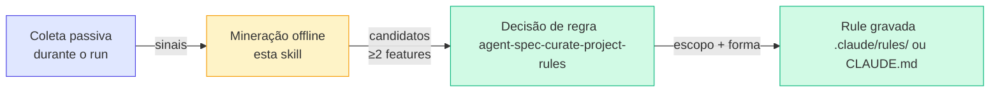

# agent-spec-mine-rule-candidates

`Compartilhada`
> **Resumo**: consolida sinais que os agentes do framework emitiram durante runs anteriores (`shared.rule_candidates.path`) e produz uma lista enxuta de **candidatos a regra**, filtrados por **repetição em features distintas**. Não decide se vira regra — entrega para [`agent-spec-curate-project-rules`](curate-project-rules.md) aplicar teste de fricção e definir colocação.

> Coleta passiva (durante o run) + mineração offline (esta skill) + decisão de regra (`agent-spec-curate-project-rules`). Aqui só agrupamos sinais que se repetiram; nunca escrevemos rule diretamente.

---

## Quando usar

* Depois de ≥ 3 features concluídas, para ver o que repetiu.
* Antes de release, como passe de "saúde do framework".
* Quando rules existentes parecem incompletas (executor ainda pergunta muito).
* Quando o staff-review repete o mesmo `convention_drift` em features diferentes.
* Quando o usuário suspeita de convenção implícita que ninguém escreveu.

## Quando NÃO usar

| Cenário | Use |
| --- | --- |
| Decidir o destino/forma de **uma** regra específica | [`agent-spec-curate-project-rules`](curate-project-rules.md) |
| Coletar sinais em tempo real | Os próprios agentes (`agent-spec-qa-validator`, `agent-spec-staff-architecture-review`) e orquestradores (`*-run-tasks`) — esta skill é offline |
| Auditar rules existentes (bloat, duplicação) | [`agent-spec-curate-project-rules`](curate-project-rules.md) (passe de auditoria) |
| Identificar bugs ou regressões | Gates do pipeline (Gate 1/Gate 2) |

---

## Modelo mental — o loop em 3 camadas



A regra do framework é simples: **um sinal isolado não vira regra**. Padrão emerge quando aparece em **≥ 2 features distintas** — antes disso, é idiossincrasia.

---

## Vocabulário canônico de sinais

Os agentes emitem sinais usando vocabulário fechado documentado em [`agent-spec-workflow-rules.md`](https://github.com/rodrigorahman/adi_agent_spec/blob/main/.claude/rules/agent-spec-workflow-rules.md):

| Sinal | Quem emite | O que captura |
| --- | --- | --- |
| `executor_askquestion` | `*-run-tasks` / `agent-spec-taskcard-run` | Executor disparou `AskUserQuestion` (convenção ausente forçou pergunta) |
| `pre_refinement_decision` | `*-run-tasks` / `agent-spec-taskcard-run` | Decisão registrada na seção "Decisões já tomadas" do agent-spec-pre-refinement |
| `exemplar_file_read` | `*-run-tasks` / `agent-spec-taskcard-run` | Executor leu arquivo "exemplar" para imitar estilo |
| `repeated_fixture` | [`agent-spec-qa-validator`](../../agents/qa-validator.md) | Mesma fixture/mock/setup em ≥ 2 testes do run |
| `repeated_assertion_shape` | [`agent-spec-qa-validator`](../../agents/qa-validator.md) | Padrão de assert idêntico em ≥ 3 lugares |
| `convention_drift` | [`agent-spec-staff-architecture-review`](../../agents/staff-architecture-review-agent.md) | Convenção implícita não-escrita divergiu entre arquivos |
| `scope_deviation` | [`agent-spec-staff-architecture-review`](../../agents/staff-architecture-review-agent.md) | Mudança fora dos arquivos declarados na task |
| `speculative_complexity` | [`agent-spec-staff-architecture-review`](../../agents/staff-architecture-review-agent.md) | Abstração/feature antecipada sem demanda |

---

## Fluxo da skill (5 fases)

### Fase 0 — Sanity check

1. Confirma o caminho canônico `shared.rule_candidates.path` em [`agent-spec-workflow-rules.md`](../../configuration/framework-paths.md). Não inventa diretório.
2. Descobre features com arquivo:
```
docs/specs/features/*/v*/rule-candidates.md
```

3. **Sem nenhum arquivo** → para e explica ao usuário. Possíveis causas: (a) instrumentação dos agentes ainda não rodou; (b) features recentes não acionaram `*-run-tasks`. **Não inventa candidatos** lendo PRDs/specs — tech-spec é fonte fraca (ver doutrina em [`agent-spec-curate-project-rules`](curate-project-rules.md)).
4. Pergunta escopo via `AskUserQuestion`: quantos runs (default 5), filtros por variante.

### Fase 1 — Coleta

Lê todos os `rule-candidates.md` no escopo e normaliza para lista de registros (feature, version, timestamp, source, signal, evidence, context).

**Validações ao parsear**:

* Sinal fora do vocabulário → loga warning e ignora.
* Linha sem `evidence` → ignora silenciosamente.
* Timestamp malformado → assume `null` (não bloqueia mineração).

### Fase 2 — Agrupamento por similaridade

Agrupa registros em **clusters** por critério específico do sinal:

| Sinal | Critério de pertencer ao mesmo cluster |
| --- | --- |
| `executor_askquestion` | Mesma pergunta normalizada **OU** mesmo tema declarado |
| `pre_refinement_decision` | Mesma decisão normalizada **OU** mesmo tema declarado |
| `exemplar_file_read` | Mesmo arquivo exemplar **OU** mesmo padrão estrutural (exemplar de handler, de service) |
| `repeated_fixture` | Mesmo path de fixture **OU** mesma forma estrutural (entidade base) |
| `repeated_assertion_shape` | Mesmo formato de assert normalizado (placeholders no lugar dos dados) |
| `convention_drift` | Mesma convenção drifted (categoria + path-padrão) |
| `scope_deviation` | Mesmo tipo de desvio (config global, shared lib) |
| `speculative_complexity` | Mesma forma de over-engineering (interface 1 impl, config-flag preventivo) |

> **Não mistura sinais diferentes no mesmo cluster** — `executor_askquestion` sobre status HTTP é candidato diferente de `convention_drift` sobre status HTTP, mesmo que tematicamente relacionados (a forma da regra final é diferente).

### Fase 3 — Filtro de repetição (gatekeeper)

Um cluster só vira candidato se:

1. **Aparece em ≥ 2 features DISTINTAS**. Repetição no mesmo run **não conta** (pode ser sintoma de uma única task mal-estruturada, não de convenção ausente).
2. **Tem evidência citável**: pelo menos 1 linha do cluster com `path:linha` ou ID de task referenciável.
3. **Não está coberto por rule existente**: grep rápido em `.claude/rules/`, `CLAUDE.md` e equivalentes do host procurando termo-chave. Se há rule → marca como `coverage_check_failed` e descarta (com nota).

::: warning ⚠️ Armadilha comum
**Descartar quando já há rule não significa "está tudo bem"** — significa que a rule existe mas o agente que emitiu o sinal **não a aplicou**. Isso é problema de matcher (rule não carrega no escopo certo) ou de fraseado (rule não é convincente). Esse caso vira tarefa para [`agent-spec-curate-project-rules`](curate-project-rules.md) no modo auditoria, não para nova regra.
:::

### Fase 4 — Candidate cards

Para cada cluster aprovado, monta cartão padronizado:

```markdown
### Candidate: <enunciado curto>

- **Sinal**: <signal>
- **Ocorrências**: N (em M features distintas)
- **Evidências**:
  - {feature-A}/v1 — T03 — "evidence literal"
  - {feature-B}/v2 — T07 — "evidence literal"
- **Tema sugerido**: <1 frase>
- **Escopo sugerido (palpite)**: global / por path (`globs sugeridos`) / inline em CLAUDE.md
- **Próximo passo**: passar para `agent-spec-curate-project-rules` aplicar teste de fricção.
```

**Regras de redação do cartão**:

* Enunciado em 1 linha (substantivo + decisão, não verbo no imperativo).
* Evidências **literais**, sem parafrasear (o que o agente emitiu).
* Escopo é **palpite** baseado nos paths dos contextos — `agent-spec-curate-project-rules` pode mover.

### Fase 5 — Handoff para `agent-spec-curate-project-rules`

Apresenta os cartões ao usuário em ordem decrescente de ocorrências. Para cada candidato selecionado, invoca `agent-spec-curate-project-rules` passando o cartão como contexto e a pergunta-âncora: *"Este candidato passa no teste de fricção? Se sim, qual escopo e forma?"*

> **Esta skill não escreve em rules.** Toda gravação é responsabilidade do `agent-spec-curate-project-rules`.

---

## Saída persistível (relatório)

Salva em `/docs/specs/.rule-mining/{YYYY-MM-DD}-mining-report.md` (`.rule-mining/` no `.gitignore` é OK — relatórios são efêmeros; o que importa é o que vira regra, registrado em `.claude/rules/` ou `CLAUDE.md`).

Conteúdo:

1. Escopo da varredura (features cobertas, janela temporal).
2. Estatísticas (total de sinais, por categoria, descartados por motivo).
3. Cartões finais.
4. Decisão do usuário por cartão (aceito / recusado / parking).

---

## Limites da skill

| Limite | Motivo |
| --- | --- |
| **Não substitui post-mortem** | Mineração olha sinais agregados; post-mortem olha um run em profundidade. Complementares |
| **Não infere regras de código** | Leitor que tenta extrair regra direto do diff erra (não há prova de repetição). Usa a fila de sinais — quem instrumenta sabe o que é convenção implícita |
| **Não decide colocação** | Escopo (global, matcher, inline) é responsabilidade do [`agent-spec-curate-project-rules`](curate-project-rules.md). A skill só sugere palpite |
| **Não dispara automaticamente** | `disable-model-invocation: true`. Roda só quando o usuário pede ou quando um workflow superior (ex.: release-check) invoca explicitamente |

---

## Sinais de uso saudável

* **Poucos cartões** (≤ 5 numa janela de 5 runs) → instrumentação calibrada; convenções estão escritas.
* **Muitos cartões repetidos do mesmo cluster ao longo do tempo** → cluster não está virando regra por algum motivo (escopo errado? fraseado fraco?). Disparar `agent-spec-curate-project-rules` em modo auditoria sobre rules adjacentes.
* **Não acha arquivos apesar de runs recentes** → instrumentação dos agentes não está rodando. Auditar `*-run-tasks`, `agent-spec-qa-validator`, `agent-spec-staff-architecture-review` para conferir emissão.

---

## Comando

`disable-model-invocation: true` — só dispara via `/agent-spec-mine-rule-candidates` ou por workflow superior que invoque explicitamente. Não roda em piloto automático.

A skill sempre mostra:

1. Resultado do sanity check (quantos runs encontrados, quantos sinais brutos).
2. Estatísticas após Fase 3 (quantos clusters sobreviveram ao filtro, quantos descartados e por quê).
3. Cartões propostos antes de chamar `agent-spec-curate-project-rules`.

---

## Resumo executivo

> Coleta passiva (durante o run) + mineração offline (esta skill) + decisão de regra ([`agent-spec-curate-project-rules`](curate-project-rules.md)). Aqui só agrupamos sinais que se repetiram em features distintas e empacotamos para a skill que decide. Nunca escrevemos rule diretamente. Nunca inferimos regra sem sinal repetido.

---

## Skills relacionadas

* [`agent-spec-curate-project-rules`](curate-project-rules.md) — decide se um candidato vira regra (teste de fricção + escopo).
* [`agent-spec-debt-resolution`](debt-resolution.md) — recolhe débito acumulado de gates (médios/baixos); complementar à mineração de convenções implícitas.

---

## Próximos passos

* [agent-spec-workflow-rules.md](../../configuration/framework-paths.md) — onde o path `shared.rule_candidates.path` e o vocabulário canônico de sinais vivem.
* [agent-spec-qa-validator (Gate 1)](../../agents/qa-validator.md) — emite `repeated_fixture` e `repeated_assertion_shape`.
* [agent-spec-staff-architecture-review (Gate 2)](../../agents/staff-architecture-review-agent.md) — emite `convention_drift`, `scope_deviation`, `speculative_complexity`.
