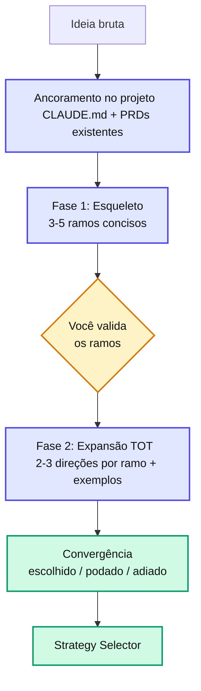

# Pre-Refinement

O **Pre-Refinement** é a primeira etapa do pipeline. Em vez de só coletar requisitos, conduz um **brainstorm de produto em Tree of Thought (TOT)** — explora os rumos que a feature pode tomar e converge com você — **antes** de qualquer skill de geração.

> Implementação: skill [agent-spec-pre-refinement](/skills/shared/pre-refinement.html) (em `.claude/skills/agent-spec-pre-refinement/`).

---

## Comando

```bash
# 1. Texto livre — ideal para ideia curta
/agent-spec-pre-refinement ""
# 2. Path de arquivo (.md ou .txt) — ideal para notas de reunião, briefing, rascunho longo
/agent-spec-pre-refinement docs/ideias/onboarding-gestor.md
```

Quando recebe um path existente terminado em `.md`/`.txt`, lê o arquivo e usa seu conteúdo como ideia bruta. Se o que parece path **não existir**, pergunta antes de assumir.

## Artefato gerado

`/docs/specs/features/{feature}/{version}/pre-refinement.md` (path resolvido via `pre_refinement.path` no [framework-paths.md](/configuration/framework-paths.html)).

---

## As 2 fases (Tree of Thought)



### Fase 1 — Esqueleto (3-5 bullets concisos)

A skill gera o **esqueleto**: 3 a 5 bullets que enquadram os **rumos** que a feature pode tomar. Cada bullet é um **ramo** (uma dimensão de produto a explorar), não um requisito. Um bom esqueleto é conciso, ortogonal, ancorado e **divergente** — inclui ≥ 1 ramo que você talvez não tenha pensado. Apresenta e **pausa** para você escolher quais ramos explorar, adicionar, remover ou repriorizar.

### Fase 2 — Expansão TOT (alternativas + exemplos por ramo)

Para cada ramo aprovado, a skill cresce **2-3 direções candidatas**, cada uma com **exemplo concreto** e nota de viabilidade contra o projeto. Dá a leitura recomendada ("recomendo A2 porque…") e pergunta — propõe + pergunta, não só interroga. Para fixes pontuais, vira 1 rodada curta confirmando escopo.

Veja [Brainstorm (Tree of Thought)](/discovery/brainstorm.html).

---

## Ancoramento no Projeto (guarda de escopo)

Antes de propor rumos, a skill olha para o projeto para não sair do escopo nem reinventar o existente:

* **O que o projeto É** — `CLAUDE.md`, `README.md`, `.cursor/rules/`.
* **O que o projeto JÁ TEM** — varre PRDs/specs existentes (`/docs/specs/**/*.md`) para evitar duplicar/conflitar e reaproveitar padrões.
* **Capacidades reutilizáveis** — dependências e módulos internos, para ancorar a viabilidade.

Rumos que extrapolam o projeto são marcados `[fora do escopo do projeto]` e não entram no escopo inicial. E preenche a **seção 10** (Ancoramento no Projeto) com o que foi consultado.

::: info 📝 Nota
A versão anterior fazia um grep obrigatório de consumidores de singleton/wire/provider (antiga seção 11.1). Isso é prep de implementação e migrou para o [tech-alignment](/skills/shared/generate-tech-alignment.html).
:::

---

## Estrutura do arquivo (16 seções)

| Seção | Conteúdo |
| --- | --- |
| 1-2 | Metadados · Ideia resumida |
| **3** | **Esqueleto do tema (Fase 1)** — os ramos |
| **4** | **Árvore de rumos (Fase 2 — TOT)** — direções candidatas, escolhida, podadas |
| 5-7 | Problema · Objetivo · Público |
| 8-9 | Escopo inicial · Fora do escopo |
| **10** | **Ancoramento no Projeto** |
| 11 | Premissas e **Decisões já tomadas (fora de negociação)** |
| 12-13 | Riscos · Dúvidas em aberto |
| **14** | **Síntese do brainstorm** — absorvido / descartado / adiado |
| **15** | **Recomendação de Framework** — [Strategy Selector](/discovery/strategy-selector.html) |
| 16 | Checklist final |

---

## Consolidação — FATO × HIPÓTESE × DÚVIDA

* **FATO**: o que o usuário afirmou (sem marcação).
* **`[HIPÓTESE]`**: inferência da skill que precisa validação.
* **`[DÚVIDA]`**: ponto em aberto que precisa resposta.

---

## Saída final ao usuário

```
Arquivo salvo em: docs/specs/features//v1/pre-refinement.md
## Resumo do Pré-Refinamento
- Ideia: ...
- Rumos explorados: X (escolhidos: A, C | podados/adiados: B)
- Problema / Público / Escopo inicial / Fora do escopo: ...
- Ancorado em: 
- Dúvidas em aberto: X | Hipóteses marcadas: X
────────────────────────────────────────
📋 Recomendação: 
Dimensões decisivas: <2 citadas> — 
Próximo passo: 
Não concorda? Pode rodar outro framework, pedir "me explique por que não ", ou editar a seção 15.
────────────────────────────────────────
```

---

## Princípios invioláveis

1. Zero solução técnica fina (arquitetura, endpoints, schemas).
2. **Fase 1 sempre pausa** — apresenta o esqueleto e espera você validar antes de expandir.
3. **Fase 2 propõe + pergunta** com exemplos concretos — não interroga seco.
4. Ancoramento no projeto obrigatório — rumos fora do escopo são marcados.
5. Zero invenção silenciosa — toda inferência é `[HIPÓTESE]`.
6. Nunca inicia a próxima etapa automaticamente.
7. **Strategy Selection** preenchida (seção 15), com **não-viés pró-SDD**.

---

## Próximos passos

* [agent-spec-pre-refinement (skill)](/skills/shared/pre-refinement.html) — implementação detalhada.
* [Brainstorm (Tree of Thought)](/discovery/brainstorm.html) — o método das 2 fases.
* [Strategy Selector](/discovery/strategy-selector.html) — recomendação por complexidade.
* [agent-spec-generate-tech-alignment](/skills/shared/generate-tech-alignment.html) — discovery **técnico**, etapa seguinte.
* [Frameworks — Overview](/frameworks/overview.html) — comparativo dos 4 caminhos.
