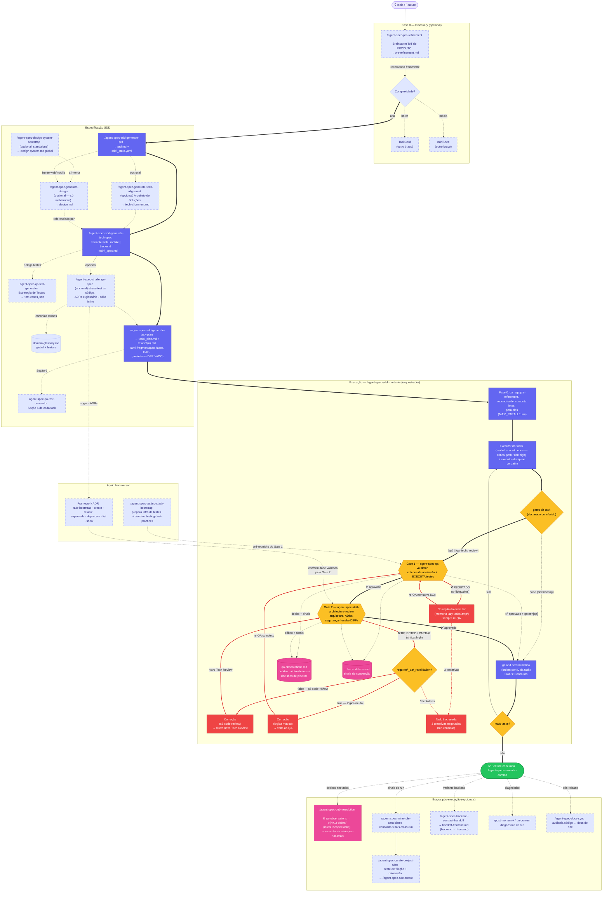

# Fluxograma — SDD

`SDD`

Ecossistema completo do [SDD](/frameworks/sdd.html): discovery, especificação (PRD → Tech Spec → Task Plan), apoio transversal (ADRs, testing-stack), execução orquestrada com os dois gates e braços pós-execução.

::: tip 💡 Dica
\*\*Clique no diagrama para abrir em tela cheia.\*\* O caminho de \*\*reprovação\*\* está em \*\*vermelho\*\* — siga-o a partir de qualquer gate. Veja a [legenda completa](/frameworks/fluxogramas/).
:::

## Fluxo principal (happy path)

1. **Discovery** (opcional): `/agent-spec-pre-refinement` recomenda SDD quando a complexidade é alta.
2. **PRD** → **Tech Spec** (variante web/mobile/backend, delega casos de teste ao `agent-spec-qa-test-generator`) → **Task Plan** (tasks com frontmatter `model`/`risk`/`gates` e paralelismo derivado).
3. **Execução**: para cada task, executor → Gate 1 (QA, único que executa testes) → Gate 2 (Tech Review) → `git add` determinístico.
4. **Conclusão**: todas as tasks aprovadas → `/agent-spec-semantic-commit` → braços pós-execução opcionais.

## Fluxos alternativos (caminho vermelho)

::: warning ⚠️ Armadilha comum
A reprovação do \*\*Gate 1\*\* sempre re-passa pelo QA. Já a reprovação do \*\*Gate 2\*\* passa pelo algoritmo `requires\_qa\_revalidation`: se todos os bloqueantes forem só de code-review (`code\_quality`, `project\_pattern`, `best\_practices`), a correção \*\*pula o QA\*\* e vai direto a um novo Tech Review.
:::

* **Gate 1 rejeita** (críticos/altos) → Correção do executor com memória lazy → re-QA (máx 3 tentativas totais).
* **Gate 2 rejeita** (`rejected`/`partial`) → `requires_qa_revalidation?` decide o retorno: re-QA completo ou direto a novo Tech Review.
* **3 tentativas esgotadas** → Task Bloqueada (dependentes bloqueadas; run continua nas demais).
* **Débito médio/baixo** → anotado em `qa-observations.md` → resolvido depois via `/agent-spec-debt-resolution`.

## 📚 Aprofundamento na Referência

* [SDD — Referência completa](/frameworks/sdd.html)
* [Pipeline — Visão Geral](/pipeline/overview.html)
* [Legenda dos fluxogramas](/frameworks/fluxogramas/)
