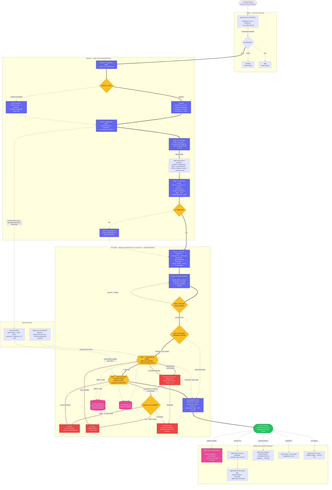

# Fluxograma — TaskCard

`TaskCard`

Ecossistema completo do [TaskCard](/frameworks/taskcard.html): discovery, geração (standard e CRUD Fast-Path), apoio transversal (ADRs, testing-stack), execução de **um card por vez** com os dois gates e braços pós-execução.

::: tip 💡 Dica
\*\*Clique no diagrama para abrir em tela cheia.\*\* O caminho de \*\*reprovação\*\* está em \*\*vermelho\*\* — siga-o a partir de qualquer gate. Veja a [legenda completa](/frameworks/fluxogramas/).
:::

## Fluxo principal (happy path)

1. **Discovery** (opcional): `/agent-spec-pre-refinement` recomenda TaskCard quando a complexidade é baixa.
2. **Geração**: pergunta a frente → modo (standard ou **CRUD Fast-Path**) → inventário de ADRs → heurística `model`/`risk`/`gates` → card salvo → `agent-spec-qa-test-generator` (standard, batch ou CRUD) → §10 formatada lossless → `task_plan.md` se ≥2 cards.
3. **Execução** (1 card por vez): preparação → executor → validação do Aceite Técnico (§9) → Gate 1 (QA) → Gate 2 (Tech Review) → **fechamento por gates aplicáveis**.
4. **Conclusão**: `git add` real, `Status: Concluído`, **não commita** → `/agent-spec-semantic-commit`.

## Fluxos alternativos (caminho vermelho)

* **Aceite Técnico incompleto** (§9) → executor relançado com apontamento antes mesmo dos gates.
* **Gate 1 rejeita** (críticos/altos) → Correção com memória lazy `TC-{id}.md` → re-QA (máx 3 tentativas).
* **Gate 2 rejeita** → `requires_qa_revalidation?` decide: re-QA completo ou direto a novo Tech Review.
* **3 tentativas esgotadas** → Card Bloqueado + `AskUserQuestion` para o usuário decidir.
* **Débito médio/baixo** → `qa-observations.md` → `/agent-spec-debt-resolution`.

::: danger 🚫 Regra
\*\*Fechamento por gates aplicáveis\*\*: o card só fecha quando \*\*todos os gates declarados no frontmatter\*\* aprovam — `gates: none` fecha após o executor, `gates: [qa]` fecha após o QA, `gates: [qa, tech\_review]` exige os dois. O TaskCard \*\*nunca paraleliza\*\* — é por definição 1 card por vez.
:::

## 📚 Aprofundamento na Referência

* [TaskCard — Referência completa](/frameworks/taskcard.html)
* [Pipeline — Visão Geral](/pipeline/overview.html)
* [Legenda dos fluxogramas](/frameworks/fluxogramas/)
