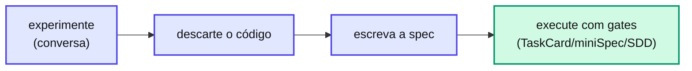

# Capítulo 9 — Conversa direta: o spike consciente

Nem toda interação com IA precisa de spec. A **conversa direta** é o caminho deliberado para o que vai ser jogado fora.

**Quando usar**: exploração, aprendizado, prototipagem — tudo que **vai ser descartado** ou **incorporado depois** via TaskCard/miniSpec/SDD.

**Quando NÃO usar**: qualquer coisa que vai para a `main`. Sem gates, sem rastreabilidade, sem versionamento.

## Por que existe um caminho "sem framework"

Forçar um spike (experimento curto e descartável) de 30 minutos a passar por TaskCard é desperdício. Reconhecer a conversa direta como caminho legítimo evita o anti-padrão oposto: cerimônia onde não há risco.

O ciclo saudável, quando você sabe que vai aproveitar o aprendizado:

::: danger 🚫 Regra
O código de um spike \*\*não vai para produção\*\* como está. Quando o aprendizado for incorporado, descarte o protótipo e reescreva sob spec com gates. A conversa direta é uma \*\*fonte de aprendizado\*\*, não um atalho para pular a revisão.
:::

## 📚 Aprofundamento na Referência

* **[Conversa direta (framework)](/frameworks/conversa-direta.html)** — o caminho sem gates em detalhe.
* **[Os 4 Caminhos (referência)](/concepts/four-paths.html)** — onde a conversa direta se posiciona.
* **[`/agent-spec-pre-refinement` (skill)](/skills/shared/pre-refinement.html)** — quando o Strategy Selector recomenda não usar framework.
