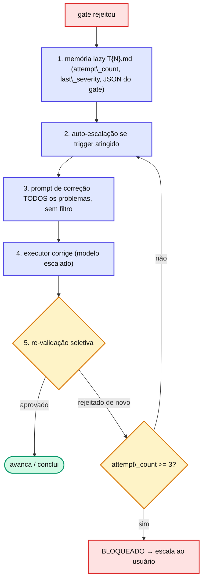

# Capítulo 13 — Loops de correção

Quando um gate reprova, o orquestrador não desiste nem entra em loop infinito. Ele executa um ciclo determinístico de correção.

## O ciclo

## Re-validação seletiva

Nem toda rejeição re-roda tudo. O orquestrador bifurca conforme `requires_qa_revalidation`:

* **Gate 1 rejeitou** → re-roda **apenas Gate 1**.
* **Gate 2 rejeitou** + `requires_qa_revalidation: true` → Gate 1 **+** Gate 2.
* **Gate 2 rejeitou** + `requires_qa_revalidation: false` → **só Gate 2**.

A `categoria` do problema decide: se o conserto pode ter quebrado algo funcional, exige re-QA; se é puramente arquitetural (naming, organização), não exige.

::: danger 🚫 Regra
\*\*Hard stop em 3 tentativas.\*\* O contador é compartilhado entre os dois gates e \*\*não reseta\*\*. Tentativa 3 (já em Opus) reprovada → a task é marcada \*\*BLOQUEADA\*\*, e o framework para e pergunta ao usuário, entregando o relatório completo (JSONs dos gates, memória lazy, paths tocados). Não há loop infinito: quando se chega aqui, geralmente a task estava \*\*mal-formulada\*\* — não que o modelo é incapaz.
:::

## 📚 Aprofundamento na Referência

* **[Gates e Loops](/concepts/gates-loops.html)** — o fluxo de validação e loop completo.
* **[qa-observations.md](/observability/qa-observations.html)** — onde cada rodada é logada para auditoria.
* **[Pipeline — visão geral](/pipeline/overview.html)** — o orquestrador que conduz o loop.
