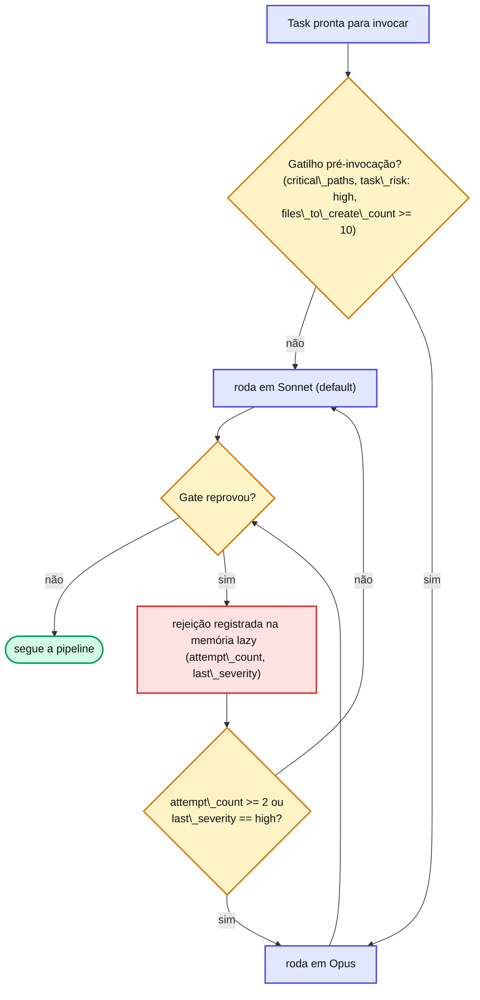

# Capítulo 14 — Auto-escalação de modelo

O default é **Sonnet** em todas as etapas — é o princípio do **modelo mínimo viável**. Mas há situações em que pagar por Opus se justifica. A pipeline escala automaticamente quando um gatilho objetivo é atingido.

## Os gatilhos

| Trigger | Quem escala | Quando |
| --- | --- | --- |
| Path toca `critical_paths` | Executor / QA / Tech Review | Antes de invocar |
| `task_risk: high` (frontmatter) | Executor / QA / Tech Review | Antes de invocar |
| `files_to_create_count >= 10` | Executor | Antes de invocar |
| `attempt_count >= 2` | Executor | Em rejeição |
| `last_severity == high` | Executor | Em rejeição |
| `qa_security_flags` não vazio | Tech Review | Antes do Gate 2 |
| `retry_attempt >= 1` | Tech Review (segundo olho) | Em retry |

O Gate 2 é **mais agressivo** na escalação que o Gate 1: uma rejeição prévia ou um flag de segurança do QA já bastam para o segundo olho subir para Opus.

No executor, os gatilhos se combinam neste fluxo de decisão:

::: tip 💡 Dica
Escalação nunca desce para Haiku: \*\*nenhum gate roda em Haiku\*\*. Code review e geração de testes exigem pattern recognition que Haiku ainda não domina com segurança. O eixo de escalação é \*\*Sonnet → Opus\*\*, nunca abaixo de Sonnet.
:::

## Por que automático

Deixar a escolha de modelo no feeling do operador reproduz o mesmo problema da escolha de caminho: ou se gasta Opus à toa, ou se usa Sonnet onde o risco pedia mais. Os gatilhos são **objetivos e auditáveis** — o mesmo diff sempre escala (ou não) da mesma forma.

## 📚 Aprofundamento na Referência

* **[Auto-escalação (referência)](/advanced/auto-escalation.html)** — a heurística sonnet→opus completa.
* **[Seleção de modelo (referência)](/advanced/model-selection.html)** — defaults por etapa.
* **[Critical Paths](/configuration/critical-paths.html)** — as categorias sensíveis que disparam escalação.
