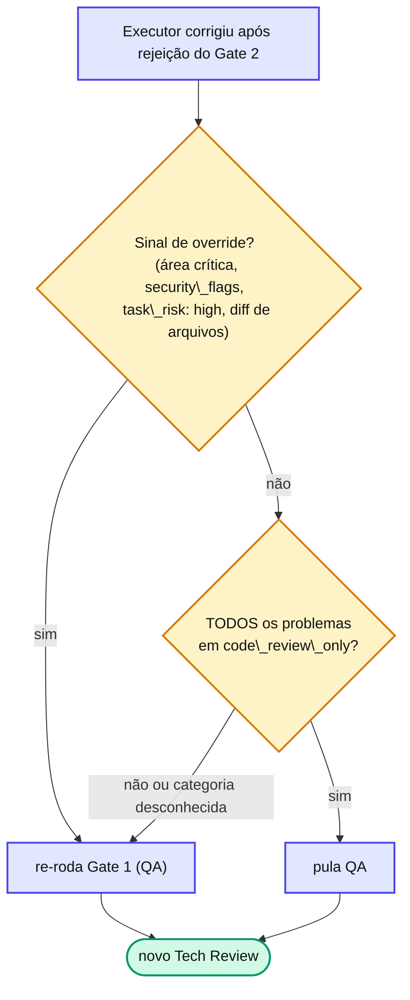

# Capítulo 16 — Categorias e o débito anotado

Aprovar com observações só funciona se a dívida **não se perder** e se o loop souber **quando re-validar**. As duas coisas dependem da `categoria` de cada problema.

## revalidation\_required vs code\_review\_only

Quando o Gate 2 rejeita e o executor corrige, o orquestrador decide se a próxima rodada **passa pelo QA de novo** ou vai direto a um novo Tech Review. A `categoria` do problema responde:

| Categoria | Classe | Por quê |
| --- | --- | --- |
| `architecture`, `security`, `tests`, `logic`, `data_handling`, `error_handling`, `performance`, `concurrency`, `adr_compliance` | **revalidation\_required** | A correção muda comportamento → QA precisa re-executar |
| `code_quality`, `naming`, `style`, `documentation`, `dead_code`, `imports` | **code\_review\_only** | Refactor sem mudar comportamento → Tech Review basta |

**Algoritmo**: se TODOS os problemas estão em `code_review_only` → pula o QA na próxima rodada. Qualquer categoria desconhecida ou em `revalidation_required` → re-QA. **Default conservador**: na dúvida, re-QA — pular indevidamente é mais caro que rodar QA num naming fix.

::: warning ⚠️ Armadilha comum
Alguns sinais \*\*sempre forçam re-QA\*\*, mesmo com problemas só de `code\_review\_only`: `tocou\_area\_critica == true`, `qa\_security\_flags` não vazio, `task\_risk: high`, ou patch que adiciona/remove arquivos (`git diff --stat` mudou). Pular o QA nesses casos é o tipo de "economia" que custa caro.
:::

O algoritmo completo, com os overrides, fica assim:



## Onde o débito vive: qa-observations.md

O arquivo `docs/specs/features/{feature}/{version}/qa-observations.md` é **versionado** (entra no Git) e appendado pelos orquestradores. Registra auto-escalações, critical paths, tasks BLOQUEADAS, **débito anotado** e o **log de retry classification**:

```markdown
### T{N} — retry classification
- attempt: 2
- problemas\_por\_categoria: { architecture: 0, code\_quality: 2, naming: 1 }
- requires\_qa\_revalidation: false
- decisao: PULE QA (próxima rodada vai direto a Tech Review)
- justificativa: "todos os problemas em code\_review\_only"
```

Esse log é **obrigatório**: sem ele, é impossível distinguir um bug do algoritmo de uma decisão correta. Com ele, cada decisão de pular/re-rodar QA é auditável.

## 📚 Aprofundamento na Referência

* **[qa-observations.md](/observability/qa-observations.html)** — todos os eventos registrados.
* **[Gates e Loops](/concepts/gates-loops.html)** — a re-validação seletiva no loop.
* **[Critical Paths](/configuration/critical-paths.html)** — os overrides que forçam re-QA.
