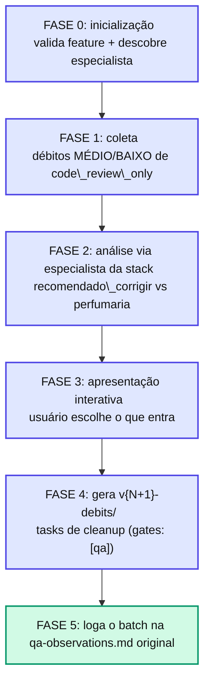

# Capítulo 17 — Fechando o ciclo: /agent-spec-debt-resolution

A política débito-controlado só funciona **se houver fechamento**. Anotar débito sem rotina de coleta vira **dump perpétuo** — o pior dos mundos: você sabe que tem dívida, mas não tem fluxo para pagá-la. A skill `/agent-spec-debt-resolution` é esse fluxo.

## O fluxo, em 5 fases

## Quem classifica é o especialista da stack

A classificação não é feita pela skill genérica — é delegada ao **agente especialista** (Go, Flutter, JS, Python…), que tem informação de domínio: sabe o custo real do fix e o risco de regressão específico. Ele devolve uma classificação binária:

* **`recomendado_corrigir`** — custo baixo, ganho claro (ex.: deletar um teste duplicado).
* **`perfumaria`** — benefício marginal vs custo (ex.: extrair um builder e reescrever 3 testes por uma magic string isolada).

Dois níveis apenas — mais confundiriam sem trazer ganho.

::: info 📝 Nota
\*\*Zero débitos coletados → aborta limpamente\*\*, sem criar `v{N+1}-debits/`. O sufixo `-debits` marca uma versão \*\*técnica\*\* (não afeta rastreabilidade funcional). As tasks de cleanup nascem com `gates: [qa]` — Tech Review traz pouco valor sobre refactor que não muda comportamento (exceto em critical paths, que forçam `[qa, tech\_review]`).
:::

## O resultado

O débito sai como um **batch coordenado** após cada feature, em vez de virar 50 micro-loops de 5 min durante a execução. Mais barato em tokens, mais limpo em commits — e o ciclo se fecha com um log do que foi resolvido na `qa-observations.md` original.

## 📚 Aprofundamento na Referência

* **[/agent-spec-debt-resolution (skill)](/skills/shared/debt-resolution.html)** — a skill completa, fase a fase.
* **[qa-observations.md](/observability/qa-observations.html)** — a fonte primária dos débitos.
* **[Fast-path Gates](/advanced/fast-path-gates.html)** — por que cleanup recebe `gates: [qa]`.
