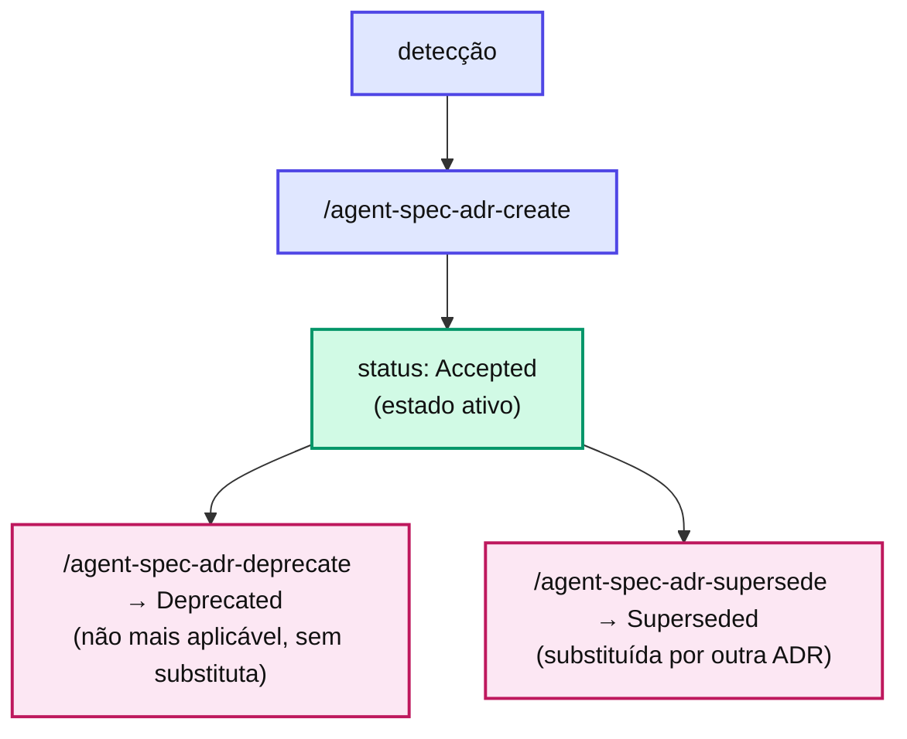

# Capítulo 21 — O lifecycle de uma ADR

Uma ADR nasce, vive e às vezes morre — mas nunca é apagada. Seu histórico é parte do valor.

## Os estados

::: danger 🚫 Regra
Skills consumidoras (gates, generators) leem \*\*APENAS\*\* ADRs `Accepted`. `Deprecated` e `Superseded` são histórico — visíveis no índice, mas \*\*não aplicáveis\*\*. Uma ADR superseded continua no repositório apontando para a que a substituiu (`Superseded by`), preservando a trilha da decisão.
:::

## Estrutura — modelo Nygard enxuto

Cada ADR segue o template Nygard: cabeçalho (`Status`, `Date`, `Tags`, `Replaces`/`Superseded by`) + as seções **Context** (por que decidir), **Decision** (a decisão), **Consequences** (o que muda), **Alternatives Considered** (o C5 — ao menos uma alternativa rejeitada) e **Applied in** (onde se aplica).

## O INDEX.md

`docs/adr/INDEX.md` é a tabela leve consumida pelo Gate 2 e pela Camada 6 do Gate 1. É gerado/regenerado por `/agent-spec-adr-reindex` — **mandatório** após cada `create` ou mudança de status, senão o índice diverge das ADRs reais.

## 📚 Aprofundamento na Referência

* **[Lifecycle de ADRs](/adr/lifecycle.html)** — os estados e transições em detalhe.
* **[Template Nygard](/adr/template-nygard.html)** — a estrutura completa de uma ADR.
* **[/agent-spec-adr-reindex (skill)](/skills/adr/adr-reindex.html)** — quem regenera o INDEX.md.
