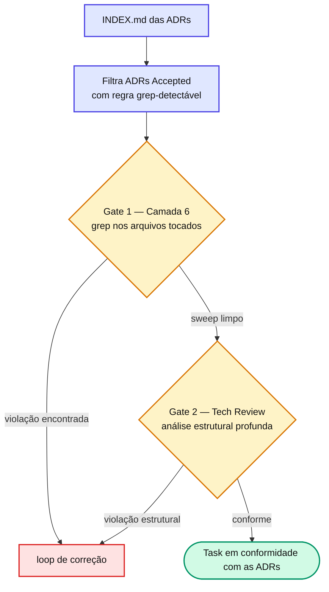

# Capítulo 22 — ADR Compliance Light no Gate 1

A Camada 6 do Gate 1 faz um **sweep grep-detectável** das ADRs ativas. Não é análise profunda — é grep + comparação. A análise estrutural fica no Gate 2.

## Grep-detectável (Gate 1) vs estrutural (Gate 2)

| Grep-detectável → Gate 1 | Estrutural → Gate 2 |
| --- | --- |
| Idioma de identificadores (tags `json:`/`form:` em inglês) → grepa termos em pt-BR | Estrutura de camadas (Repository/Service/Handler) |
| Naming para soft delete (`SoftDelete(`) | Composição de erros (exige entender o fluxo) |
| Injeção direta de pool de DB fora do startup | Estilo de testes (exige semântica) |
| Provider singleton para SDK fora do Wire | — |

A regra é simples: se a violação aparece num `grep` sobre o diff, é Gate 1; se exige entender a arquitetura, é Gate 2.

::: info 📝 Nota
\*\*Por que pegar isso já no Gate 1\*\*: o post-mortem `cadastro-pratos-franquia` mostrou que violações grep-detectáveis de ADR cascateavam por 3+ tasks quando só apareciam no Gate 2 (a ADR-0010 atingiu T5, T6 e T7 ao mesmo tempo). Pegar cedo, com um grep barato, evita rodadas de correção em tasks posteriores. O procedimento lê o `INDEX.md`, filtra ADRs `Accepted` e grepa cada regra detectável nos arquivos tocados.
:::

## 📚 Aprofundamento na Referência

* **[agent-spec-qa-validator (Gate 1)](/agents/qa-validator.html)** — a Camada 6 (ADR Compliance Light).
* **[agent-spec-staff-architecture-review (Gate 2)](/agents/staff-architecture-review-agent.html)** — a análise estrutural profunda de ADRs.
* **[Lifecycle de ADRs](/adr/lifecycle.html)** — por que só ADRs `Accepted` entram no sweep.
