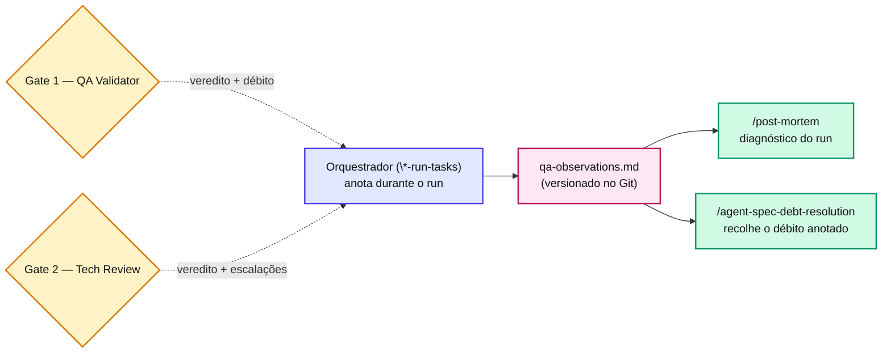

# Capítulo 23 — A trilha de auditoria: qa-observations.md

`docs/specs/features/{feature}/{version}/qa-observations.md` é o **arquivo versionado** (entra no Git) que os três orquestradores appendam incrementalmente durante a execução. É a caixa-preta do run.

## Os eventos gravados

| Evento | Quando | Severidade |
| --- | --- | --- |
| Auto-escalação do executor | Task `sonnet` que escala para `opus` em retry | Info |
| Auto-escalação do Gate 2 | Tech Review escalado por security\_flags ou retry | Info |
| Critical path detectado | Task tocou path em `critical_paths` | Info |
| `gates: none` | Task pulou todos os gates por declaração explícita | Aviso |
| Task BLOQUEADA | 3 tentativas sem aprovação dos dois gates | Erro |
| Débito anotado | Task aprovada como `APROVADO_COM_OBSERVACOES` | Info |
| Retry classification | Decisão `requires_qa_revalidation` em loop | Info |

## Por que a auditoria é obrigatória

O log de **retry classification** é o melhor exemplo: sem ele, é impossível distinguir um bug do algoritmo de uma decisão correta de pular/re-rodar o QA. O post-mortem `cadastro-pratos-franquia` levantou suspeita de que uma task `naming/style` foi re-QA indevidamente — só foi possível investigar porque a decisão e a justificativa estavam logadas.

::: info 📝 Nota
`qa-observations.md` é também a \*\*fonte primária\*\* de [`/agent-spec-debt-resolution`](/skills/shared/debt-resolution.html) (visto na [Parte V](/partes/parte-5/capitulo-17.html)): o débito anotado aqui é o que a skill de cleanup recolhe depois. Observabilidade e a política débito-controlado são dois usos do mesmo arquivo.
:::

## 📚 Aprofundamento na Referência

* **[qa-observations.md](/observability/qa-observations.html)** — todos os eventos e o formato do log.
* **[State files](/observability/state-files.html)** — o estado estruturado que complementa a trilha.
* **[/agent-spec-debt-resolution](/skills/shared/debt-resolution.html)** — consome o débito anotado.
