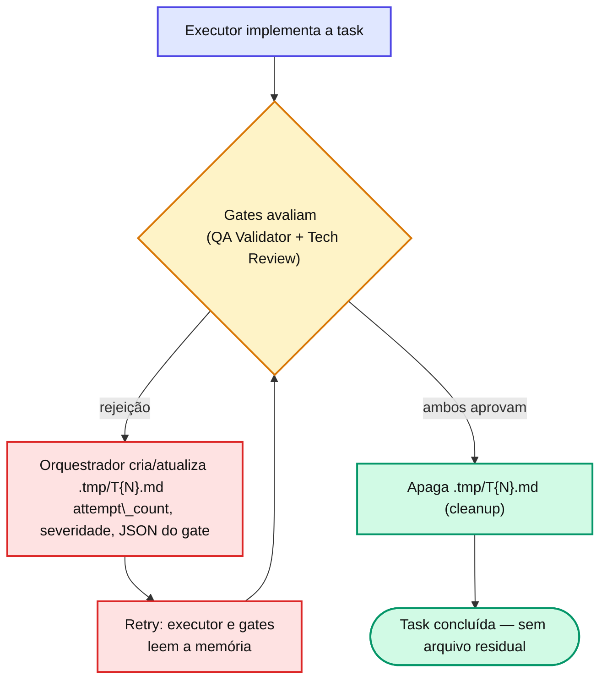

# Capítulo 24 — Memória lazy e memória inline

O framework tem **duas formas** de memória entre subagentes. Conhecer a diferença evita criar arquivos parasitas — e é uma aplicação direta do princípio do **contexto mínimo**.

## Memória lazy — `T{N}.md` em `.tmp/`

| Atributo | Valor |
| --- | --- |
| Path | `docs/specs/features/{feature}/{version}/tasks/.tmp/T{N}.md` |
| Criada por | Orquestrador, **apenas** em rejeição de gate |
| Lida por | Executor (em retry) e os gates (contexto de retry) |
| Conteúdo | `attempt_count`, `last_severity`, JSON do(s) gate(s) que rejeitaram, paths tocados |
| Apagada quando | Ambos os gates aprovam |
| Versionada | **Não** (`.gitignore`) |

**Por que lazy**: cria custo só quando há rejeição — aprovação na primeira tentativa não gera arquivo nenhum. **Por que dentro da feature** (e não em `.claude/.tmp/`): `.claude/` é área protegida e exigia autorização a cada gravação; mover para `tasks/.tmp/` eliminou o prompt e co-localizou a memória com as tasks.

## Memória inline — `base_sha` + sumário do executor

| Atributo | Valor |
| --- | --- |
| Persistida em | Variáveis em memória do orquestrador (não em disco) |
| Lida por | Gate 1 e Gate 2, inline em `instrucoes` |
| Conteúdo | `base_sha` (SHA git pré-task) + sumário do executor (4-6 linhas) |

::: tip 💡 Dica
A versão anterior gravava um `T{N}-execution-summary.md` com `git diff --stat`, hashes SHA-256 e paths consolidados. Esses campos eram \*\*redundantes\*\* (o Tech Review gera o diff sozinho via `git diff `) ou \*\*nunca consultados\*\*. Cortar isso economizou ~300-800 tokens × 2 gates × N tasks por run — menos arquivo, fluxo mais simples.
:::

## 📚 Aprofundamento na Referência

* **[Memória temporária (configuração)](/configuration/temp-memory.html)** — o diretório `.tmp/` e seu ciclo.
* **[Depuração da memória temporária](/observability/temp-memory-debug.html)** — como inspecionar a memória lazy.
* **[Contexto mínimo (referência)](/concepts/minimum-context.html)** — o princípio por trás da memória inline.
