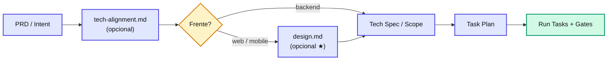

# agent-spec-generate-design

`Shared` `Discovery`
> **Resumo**: **Design Engineer**. A partir de um PRD (SDD) ou Intent (miniSpec), gera o **`design.md`** da feature — o **COMO VISUAL** (telas, layout, estados visuais concretos, responsividade, motion, tema, a11y visual, assets) — e mantém o **`design-system.md`** global (tokens, biblioteca de componentes). Etapa **opcional** do pipeline, exclusiva das frentes **web/mobile** (backend é recusado com orientação). Ancora no design system real do projeto antes de propor; aceita Figma/mockups como referência **sem depender deles**. Quando o `design.md` existe, as seções de Fluxos de Interface e Comportamento Visual da TECH\_SPEC/SCOPE **referenciam** o design em vez de redefini-lo.

---

## Quando usar

* Após `prd.md` (SDD) ou `intent.md` (miniSpec) aprovado, **antes** do TECH\_SPEC/SCOPE, quando a feature tem **interface relevante** (telas novas, fluxo visual novo, estados não triviais).
* Quando há mockups/Figma a serem registrados de forma estruturada e verificável no fluxo de desenvolvimento.
* Quando a feature introduz componentes ou tokens novos que merecem avaliação contra o design system existente.

## Quando NÃO usar

* **Features backend** — não têm design; estados de API ficam na tech spec backend e no [agent-spec-backend-contract-handoff](/skills/shared/backend-contract-handoff.html). A skill recusa com orientação.
* Features web/mobile **triviais** (ajuste pontual sem impacto visual novo) — o fluxo normal cobre: as seções 4–5 da TECH\_SPEC/SCOPE especificam a UI como sempre fizeram.
* Para decidir **arquitetura técnica** (gestão de estado, APIs, cache) → isso é do [agent-spec-generate-tech-alignment](/skills/shared/generate-tech-alignment.html) / [agent-spec-sdd-generate-tech-spec](/skills/sdd/sdd-generate-tech-spec.html).

---

## Inputs

| Input | Origem | Obrigatório? |
| --- | --- | --- |
| Caminho do `prd.md` (SDD) ou `intent.md` (miniSpec) | Usuário (arg 1) | **Sim** |
| Links de Figma/protótipo, screenshots ou descrição livre do design | Usuário (arg 2) | **Não** — se vier, é referência primária a destrinchar; se não, a skill propõe a partir do design system existente |
| `design-system.md` global + design system real do codebase (tema, tokens, componentes) | Ancoragem | Sim |
| PRD/Intent + discovery (`pre-refinement.md`, `tech-alignment.md`) + ADRs ativas (tag `ui`) | Ancoragem | Sim |

> A skill **detecta o framework** pelo nome do arquivo (`prd.md` → SDD; `intent.md` → miniSpec) e **sempre pergunta a frente** (web/mobile/backend) via `AskUserQuestion` — backend encerra sem criar arquivo.

## Outputs

| Artefato | Path resolvido | Consumido por |
| --- | --- | --- |
| `design.md` (feature) | `design.feature.path` → `/docs/specs/features/{feature}/{version}/design.md` | [agent-spec-sdd-generate-tech-spec](/skills/sdd/sdd-generate-tech-spec.html) (§4–5 viram referência), [agent-spec-minispec-generate-scope](/skills/minispec/minispec-generate-scope.html), geradores de tasks (arquivo de referência das tasks de UI), [agent-spec-qa-validator](/agents/qa-validator.html) (Camada 4) |
| `design-system.md` (global, lazy) | `design_system.global.path` → `/docs/specs/design-system.md` | Todas as features web/mobile — fonte canônica de tokens e componentes |

---

## A trava dupla (o território da skill)

::: warning ⚠️ Armadilha comum
A pergunta de calibragem: \*\*"isso descreve algo que o usuário vê ou sente na interface?"\*\*
\* \*\*Limite superior — produto não entra.\*\* O QUE a feature faz e POR QUÊ vêm do PRD/Intent. A skill não decide regra de negócio nem comportamento funcional — apenas a forma visual do que já foi decidido. Dependência de produto → "Pontos em aberto".
\* \*\*Limite inferior — mecânica técnica não entra.\*\* Gestão de estado, endpoints, cache, nomes de arquivos de código e estratégia de testes são do TECH\\_SPEC/SCOPE. A fronteira prática: o design.md diz \*\*o que o usuário vê\*\* ("toast de erro com ação Tentar novamente"); a tech spec diz \*\*como a máquina faz\*\* (retry, interceptor, error boundary).
:::
::: danger 🚫 Regra
\*\*Estados visuais devem ser concretos e verificáveis\*\* — "skeleton de card com 3 linhas", "empty state com ilustração + CTA Criar pedido", nunca "mostrar loading/erro" genérico. Estado genérico não é verificável pelo QA (Camada 4 valida a implementação contra o design.md).
:::

---

## Dois níveis: `design.md` × `design-system.md`

Espelha o padrão do glossário de domínio (dois níveis, criação lazy):

| Vai pro **GLOBAL** (`design-system.md`) | Fica no **FEATURE** (`design.md`) |
| --- | --- |
| Tokens (cores, tipografia, espaçamento) | Layout e composição das telas da feature |
| Componentes reutilizáveis entre features | Estados visuais das telas da feature |
| Breakpoints, grid, tema/dark mode do produto | Interações, motion e assets específicos |

**Default em caso de dúvida: FEATURE.** Promover ao global é decisão explícita (afeta todas as features) e exige confirmação do usuário — o inverso do glossário. O update do global é sempre **cirúrgico** (apenas entradas novas).

---

## Posição no pipeline



Quando o `design.md` existe, a corrente continua: o gerador de tasks lista o `design.md` nos **Arquivos de Referência** das tasks que tocam camada UI (minimum-context — tasks de service/store puro não o recebem), o executor o lê como contrato visual, e o **QA Validator (Gate 1)** valida na Camada 4 (Completude) que os estados implementados correspondem ao especificado — presença e comportamento, **não** fidelidade pixel-perfect.

---

## Fluxo de execução

1. **Detecta o framework** pelo nome do arquivo (`prd.md`/`intent.md`) e **pergunta a frente** — backend encerra com orientação, sem criar arquivo.
2. **Resolve os paths** (`design.feature.path` / `design_system.global.path`).
3. **Ancoragem** — lê PRD/Intent (QUE/PORQUÊ fechados), discovery, `design-system.md` global, **design system real do codebase** (tema, tokens, biblioteca de componentes, padrões de loading/erro existentes) e ADRs tag `ui`; destrincha referências do usuário (Figma/mockups — MCP opcional, nunca bloqueante).
4. **Propõe o design** tela a tela (uma decisão por vez, liderando com recomendação): inventário de telas, layout, **estados visuais concretos**, responsividade/plataforma, tema, motion, a11y visual, assets.
5. **Separa GLOBAL vs FEATURE** — candidatos ao design-system.md confirmados com o usuário; decisões transversais com trade-off viram candidatas a ADR (tag `ui`).
6. **Preenche o template** (web ou mobile), **salva** `design.md` (e atualiza o global cirurgicamente, se houver) e atualiza o estado do pipeline (`steps.design`).

---

## Gates invocados

Nenhum.

## Templates / assets usados

* [`assets/design_template_web.md`](https://github.com/rodrigorahman/adi_agent_spec/tree/main/.claude/skills/agent-spec-generate-design/assets/design_template_web.md) — 12 seções (tokens, mapa visual, estados, responsividade, tema, motion, a11y visual, assets).
* [`assets/design_template_mobile.md`](https://github.com/rodrigorahman/adi_agent_spec/tree/main/.claude/skills/agent-spec-generate-design/assets/design_template_mobile.md) — idem + Offline como estado de primeira classe, adaptação iOS/Android, gestos/háptico, safe areas.

---

## Exemplo de uso

```bash
# Com Figma como referência:
/agent-spec-generate-design docs/specs/features/checkout/v1/prd.md \
"https://figma.com/file/abc123/checkout — design pronto nesse arquivo"
# Sem referência (a skill propõe a partir do design system existente):
/agent-spec-generate-design docs/specs/features/checkout/v1/prd.md
```
```
[Detecção: SDD (prd.md)] [Frente: web (confirmada)]
[Ancoragem: tailwind.config + components/ui (shadcn) + padrão skeleton existente]
[Telas: Carrinho, Pagamento, Confirmação — layout proposto por tela]
[Estados: 3 telas × 4 estados concretos | Componentes: 7 reusados, 1 novo (Stepper)]
[Global: Stepper candidato ao design-system.md — confirmado com usuário]
✅ design.md salvo | design-system.md atualizado (1 entrada)
Candidatas a ADR (ui): nenhuma
```

---

## Skills relacionadas

* [agent-spec-design-system-bootstrap](/skills/shared/design-system-bootstrap.html) — consolidação standalone do `design-system.md` global (codebase + Figma + docs soltos); esta skill faz só updates cirúrgicos no global, por feature.
* [agent-spec-generate-tech-alignment](/skills/shared/generate-tech-alignment.html) — irmã técnica: decide o COMO arquitetural; esta decide o COMO visual.
* [agent-spec-sdd-generate-tech-spec](/skills/sdd/sdd-generate-tech-spec.html) / [agent-spec-minispec-generate-scope](/skills/minispec/minispec-generate-scope.html) — consomem o design (seções de UI viram referência).
* [agent-spec-adr-create](/skills/adr/adr-create.html) — registra decisões de design transversais (tag `ui`).
* [agent-spec-backend-contract-handoff](/skills/shared/backend-contract-handoff.html) — o equivalente backend→frontend (estados de API, não design).

## Configuração via framework-paths.md

Paths usados: `design.feature.path` e `design_system.global.path` (compartilhados SDD + miniSpec, definidos em `agent-spec-workflow-rules.md` → "Design — Dois Níveis"). Veja [Path Templates](/configuration/path-templates.html).
