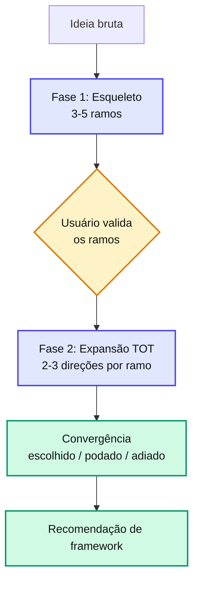

# agent-spec-pre-refinement

`Shared` `Discovery`
> **Resumo**: Parceiro de **discovery de produto**. Em vez de só coletar requisitos, conduz um **brainstorm em Tree of Thought (TOT)** em 2 fases — explora os rumos que a feature pode tomar, propõe direções com exemplos e converge com o usuário. Ancora os rumos no codebase e em PRDs existentes para não sair do escopo do projeto. Ao final, salva o `pre-refinement.md` e **recomenda o framework** (SDD/miniSpec/TaskCard/Conversa direta) pela complexidade que emergiu.

---

## Quando usar

* **Antes** de qualquer skill de geração (PRD, INTENT, TaskCard).
* Quando a ideia ainda está vaga, ampla ou em aberto e vale discutir os rumos.
* Quando você não tem certeza qual framework usar.

## Quando NÃO usar

* Ideia já cristalina e fechada com a próxima skill clara → vá direto à geração.
* Para gerar PRD, Tech Spec ou TaskCard — esta skill **não** gera nenhum desses; produz apenas o `pre-refinement.md` intermediário.

---

## Inputs

| Input | Origem | Obrigatório? |
| --- | --- | --- |
| `$ARGUMENTS` — ideia em **texto livre** OU **path** para `.md`/`.txt` | Usuário | Sim |
| Codebase + PRDs/specs existentes (`/docs/specs/**/*.md`) | Varredura de ancoramento | Sim |
| `CLAUDE.md` + `.claude/rules/*` | System-prompt | Sim |

> Aceita texto livre ou path. Quando o argumento parece path e o arquivo existe, lê o conteúdo com `Read`; se não existir, pergunta antes de seguir.

## Outputs

| Artefato | Path resolvido | Consumido por |
| --- | --- | --- |
| `pre-refinement.md` | `pre_refinement.path` → `/docs/specs/features/{feature}/{version}/pre-refinement.md` | [agent-spec-sdd-generate-prd](/skills/sdd/sdd-generate-prd.html), [agent-spec-minispec-generate-intent](/skills/minispec/minispec-generate-intent.html), [agent-spec-taskcard-generate](/skills/taskcard/taskcard-generate.html) |

---

## Tree of Thought — o método

TOT = não fixar na primeira solução mental. Para cada tema, **gerar vários ramos, avaliar, podar os fracos e expandir os promissores** — com o usuário no loop nas decisões de poda.



---

## As 2 fases

### Fase 1 — Esqueleto (3-5 bullets concisos)

A skill gera o **esqueleto**: 3 a 5 bullets concisos que enquadram os **rumos** que a feature pode tomar do ponto de vista de produto. Cada bullet é um **ramo** (uma dimensão a explorar), não um requisito fechado. Um bom esqueleto é conciso, ortogonal, ancorado e divergente (inclui ≥ 1 ramo que o usuário talvez não tenha pensado).

A skill **apresenta o esqueleto e pausa** via `AskUserQuestion` — o usuário escolhe quais ramos explorar, adiciona, remove ou repriorize.

### Fase 2 — Expansão TOT (alternativas + exemplos por ramo)

Para cada ramo aprovado, a skill **cresce 2-3 direções candidatas**, cada uma com **exemplo concreto** e nota de viabilidade contra o projeto. Dá sua leitura ("recomendo A2 porque…") e pergunta. Regras: propor + perguntar (não só interrogar), exemplos obrigatórios, ≤ 2-3 rodadas, continua no O QUÊ/POR QUÊ (sem arquitetura).

Para ideias **fechadas** (fix pontual), a Fase 2 vira 1 rodada curta confirmando escopo — não força 3 direções onde não há espaço.

---

## Ancoramento no Projeto (guarda de escopo)

Antes de propor qualquer rumo, a skill **olha para o projeto** para não brainstormar fora do escopo nem reinventar o existente:

1. **O que o projeto É** — `CLAUDE.md`, `README.md`, `.cursor/rules/`.
2. **O que o projeto JÁ TEM** — varre PRDs/specs existentes (`/docs/specs/**/*.md`) para evitar duplicar/conflitar com features já especificadas e reaproveitar vocabulário/padrões.
3. **Capacidades reutilizáveis** — olhada rápida em dependências e módulos internos para ancorar a **viabilidade** dos rumos.

Rumos que extrapolam o projeto são marcados `[fora do escopo do projeto]` e não entram no escopo inicial.

::: info 📝 Nota
A versão anterior fazia um \*\*grep obrigatório de todos os consumidores de singleton/wire/provider\*\*. Isso é prep de implementação e migrou para o [tech-alignment](/skills/shared/generate-tech-alignment.html) — aqui o foco é não sair do escopo do produto, não mapear refactors.
:::

---

## Princípio fundamental — FATO × HIPÓTESE × DÚVIDA

| Categoria | Marcação | Exemplo |
| --- | --- | --- |
| **FATO** | Sem marcação | "O sistema atual usa JWT para auth" (afirmado pelo usuário) |
| **`[HIPÓTESE]`** | Marcação explícita | "[HIPÓTESE] O CPF é obrigatório no cadastro" (inferência da skill) |
| **`[DÚVIDA]`** | Listada na seção de Dúvidas | "Como o multi-tenant atual lida com migrations?" |

> Evita que hipóteses não validadas vazem como fatos para os artefatos downstream.

---

## Estrutura do `pre-refinement.md`

| Seção | Conteúdo |
| --- | --- |
| 1 | Metadados (feature, versão, fonte, status) |
| 2 | Ideia resumida (1 frase) |
| **3** | **Esqueleto do tema (Fase 1)** — os 3-5 ramos |
| **4** | **Árvore de rumos (Fase 2 — TOT)** — direções candidatas, escolhida, podadas |
| 5-7 | Problema · Objetivo · Público |
| 8-9 | Escopo inicial (convergência) · Fora do escopo (podado/adiado) |
| **10** | **Ancoramento no Projeto** — PRDs/capacidades consultados |
| **11** | Premissas e **Decisões já tomadas (fora de negociação)** |
| 12-13 | Riscos · Dúvidas em aberto |
| **14** | **Síntese do brainstorm** — absorvido / descartado / adiado |
| **15** | **Recomendação de framework** — [Strategy Selector](/discovery/strategy-selector.html) |
| 16 | Checklist final |

> A subseção "Decisões já tomadas (fora de negociação)" (seção 11) é lida pelos orquestradores `*-run-tasks` para emitir o sinal de rule-mining `pre_refinement_decision`.

---

## Strategy Selector (seção 15) — 3 dimensões

A recomendação de framework baseia-se na **complexidade que emergiu do brainstorm**:

| Dimensão | Pergunta | Faixa |
| --- | --- | --- |
| **Amplitude** | Quantos rumos/US sobreviveram à convergência? | `0` / `1` / `2-3` / `4+` |
| **Personas** | Quem é afetado além do dev? | `só dev` / `dev+1` / `múltiplas personas` |
| **Novidade** | Ajuste, incremento ou módulo novo? | `ajuste` / `incremento` / `greenfield` |

Mais 1 sinal de apoio: **decisão arquitetural transversal nova?** (puxa para SDD + sugere ADR). Resultado: **Conversa direta**, **TaskCard** (com `--mode=crud-fastpath` se for CRUD repetindo pattern), **miniSpec** ou **SDD**. Detalhes e tabela de decisão em [Strategy Selector](/discovery/strategy-selector.html).

---

## Fluxo de execução

1. **Resolve a entrada** (texto livre ou path).
2. **Ancoramento no Projeto** (CLAUDE.md/README + `/docs/specs/**/*.md` + capacidades).
3. **Fase 1** — gera o esqueleto e pausa para validação.
4. **Fase 2** — expande cada ramo via TOT e converge.
5. **Consolida** o documento (FATO × HIPÓTESE × DÚVIDA + síntese).
6. **Strategy Selection** (seção 15).
7. **Salva** em `pre_refinement.path` resolvido.

---

## Gates invocados

Nenhum.

## Modelo

**Sonnet** recomendado — raciocínio estruturado e divergente. Opus só se a ideia for genuinamente ambígua e de alto risco de produto.

## Templates / assets usados

* `assets/pre-refinement-template.md` — estrutura canônica (16 seções, incluindo esqueleto e árvore de rumos).

---

## Exemplo de uso

```bash
# Texto livre
/agent-spec-pre-refinement "queria adicionar busca por filtros no catálogo, sei lá"
# Arquivo com notas mais longas
/agent-spec-pre-refinement docs/ideias/catalogo-filtros.md
```
```
[Ancoramento]: detectou feature cardapio-digital/v1 (cobre listagem) + auth via pkg/jwt
[Fase 1 — Esqueleto]:
1. Filtros server-side vs client-side
2. Persistência da escolha do usuário
3. Ordenação combinável com filtros
→ usuário: explorar 1 e 3, adiar 2
[Fase 2 — TOT no ramo 1]: 3 direções com exemplo + viabilidade → escolhido server-side
[Strategy Selector]: amplitude 2-3 rumos, dev+1, incremento → miniSpec
✅ pre-refinement.md salvo em /docs/specs/features/catalogo-filtros/v1/pre-refinement.md
```

---

## Skills relacionadas

* [Discovery — Overview](/discovery/overview.html) — fluxo completo do discovery.
* [Strategy Selector](/discovery/strategy-selector.html) — recomendação por complexidade.
* [Brainstorm (Tree of Thought)](/discovery/brainstorm.html) — o método das 2 fases.
* [agent-spec-generate-tech-alignment](/skills/shared/generate-tech-alignment.html) — discovery **técnico** (decisões de arquitetura), etapa seguinte.
* [agent-spec-sdd-generate-prd](/skills/sdd/sdd-generate-prd.html), [agent-spec-minispec-generate-intent](/skills/minispec/minispec-generate-intent.html), [agent-spec-taskcard-generate](/skills/taskcard/taskcard-generate.html) — consumidores típicos.

## Configuração via framework-paths.md

Paths usados: `pre_refinement.path`. Veja [Path Templates](/configuration/path-templates.html).
